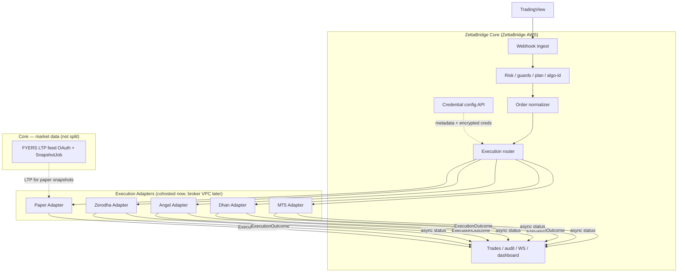
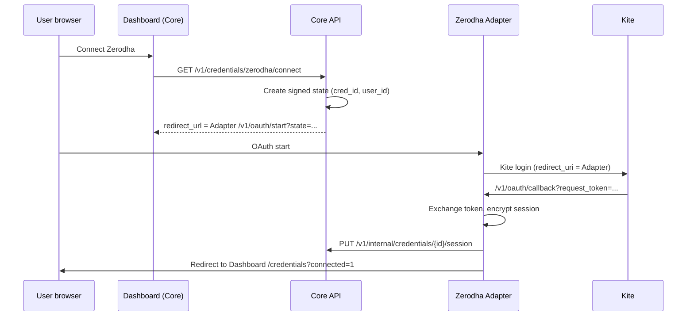
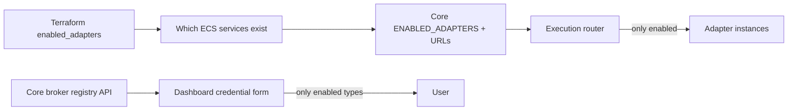

# ZettaBridge — Execution Adapter Split Plan

**Status:** Approved for implementation  
**Branch:** `zerodha_first_demo`  
**Last updated:** 2026-07-05

This document supersedes the informal adapter-split discussion and incorporates two product decisions:

1. **Two execution modes only:** Paper Trading (Free) and Live Trading (Pro). No demo/mock broker trading. No Household/Org plan.
2. **Broker boundary:** All **live broker** API traffic and broker-originated callbacks land on **Execution Adapters**. Core keeps non-execution integrations (TradingView ingest, Stripe, auth, **FYERS market-data feed** — see §6.1).

---

## Confirmed decisions (2026-07-05)

| # | Decision | Resolution |
|---|----------|------------|
| 1 | Rename `individual` → `pro` in DB/API | **Yes** — `users.plan` CHECK becomes `('free', 'pro')`; Stripe price ID env var renamed accordingly |
| 2 | Existing `household` users | **Pre-production** — migrate all to `free` (paper trading) or delete test accounts; no admin review needed |
| 3 | FYERS market-data OAuth/quotes/refresh | **Stays entirely in Core** — current `internal/marketdata/fyers` is not split to adapters |
| 4 | FYERS as live broker (future) | **Future Execution Adapter** on FYERS/broker-hosted infra — design informed by FYERS/SEBI rules (§6.4) |
| 5 | `account_mode` column | Keep, fixed to `live` only |
| 6 | Paper adapter hosting | Cohosted with Core for phases 1–4 (PG coupling) |
| 7 | CI without real brokers | Inject fake `adapter.Client` in tests; no user-facing mock broker mode |
| 8 | **Day-0 adapter deploy scope** | **Paper + Zerodha only** (OAuth + Publisher fully operational). Angel, Dhan, MT5 **not deployed** until live E2E is ready — gated by config/Terraform |

---

## 1. Target Product Model

### 1.1 Plans (after cleanup)

| Plan | Internal ID | Paper trading | Live broker trading |
|------|-------------|---------------|---------------------|
| **Free** | `free` | Yes (paper accounts + paper webhooks) | No |
| **Pro** | `pro` | Yes (same paper engine; optional UX cap) | Yes (broker credentials + live webhooks) |

**Removed:**

| Removed concept | Was | Replacement |
|-----------------|-----|-------------|
| Demo / mock broker trading | `account_mode=demo`, `integrations/brokers/demo/*`, `BROKER_MODE=mock` user routing | Paper Trading Engine |
| Household / Org plan | `household`, org workspaces, shared webhooks/creds | Solo users only; Pro for live |
| Early-bird live on Free | `early_bird_live`, free users hitting real brokers | Upgrade to Pro |
| `individual` plan name | Paid solo tier | Renamed to `pro` (confirmed) |

### 1.2 Execution destinations (unchanged concept, simplified routing)

Every webhook has exactly one destination:

- `paper_account_id` → **Paper Adapter** (broker-free simulation)
- `broker_cred_id` → **Live Broker Adapter** (real broker APIs; Pro plan required)

There is no third path (no mock broker, no broker-side demo server, no MT5 demo routing for Free users).

### 1.3 What “remove demo trading” means in code

| Area | Remove / change |
|------|-----------------|
| `plan.AccountDemo`, `account_mode` column semantics | Drop `demo` mode; credentials are **live-only** (`account_mode` fixed to `live` or column removed) |
| `internal/integrations/brokers/demo/*` | Delete (keep httptest fixtures under `_test` only if needed for CI) |
| `brokerfactory.ResolveExecution` mock branches | Replace with: Free + live webhook → `403 plan.ErrLiveNotAllowed`; Pro + live webhook → always live adapter |
| `BROKER_MODE=mock` production routing | Remove from user-facing paths; optional **test-only** mock HTTP server for CI (not selectable per user/plan) |
| `BROKER_MT5_DEMO_BASE_URL`, demo base URLs in `livebrokers.URLs` | Remove demo URL routing |
| Dashboard “Demo” credential mode | Already removed from create flow; delete edit-mode demo labels and `account_mode` selector |
| Early-bird live (`early_bird_live`, `live_orders_used`, env vars) | Remove |
| Free-plan mock / MT5-demo tests | Rewrite to expect paper trading or Pro gate |

**Keep:** Paper Trading Engine (`internal/paperengine`) — this is **not** demo trading; it is the Free-tier simulation product.

---

## 2. Org / Household Removal

### 2.1 Scope of removal

**Application code (delete or simplify):**

| Package / area | Action |
|----------------|--------|
| `internal/modules/orgs/` | Remove module |
| `internal/plan/effective.go` org override | Remove; `EffectivePlan(user.Plan)` = `user.Plan` |
| `plan.PlanHousehold`, org-scaled limits in `limits.go` | Remove |
| `internal/transport/http/middleware/org.go` | Remove |
| Org routes in `router.go` (`/v1/orgs/*`, org-scoped webhook/cred listing) | Remove |
| Org invites (`invites` org paths) | Remove org invite flows; keep platform admin invites if still needed |
| `shared.EnforceOrgScope`, org webhook/cred ownership checks | Simplify to user-scoped only |
| `webhooks.org_id`, `broker_credentials.org_id` usage | Stop writing; reads ignore |
| Dashboard `app/(app)/org/*`, Org nav | Remove |
| Billing household SKU, `StripePriceHousehold`, `orgs_enabled` | Remove |
| Admin org list/detail endpoints | Remove or archive read-only for support |

**Database (safe migration — do not drop tables in v1):**

Migration `044_simplify_plans.sql` (example):

```sql
-- Rename individual → pro; household → free (pre-production, no live customers)
UPDATE users SET plan = 'pro' WHERE plan = 'individual';
UPDATE users SET plan = 'free' WHERE plan = 'household';

-- Optional: delete org-only test users if no longer needed
-- DELETE FROM users WHERE plan = 'household' AND email LIKE '%@test.%';

ALTER TABLE users DROP CONSTRAINT IF EXISTS users_plan_check;
ALTER TABLE users ADD CONSTRAINT users_plan_check CHECK (plan IN ('free', 'pro'));

-- Detach org ownership from active resources (solo-only going forward)
UPDATE webhooks SET org_id = NULL WHERE org_id IS NOT NULL;
UPDATE broker_credentials SET org_id = NULL WHERE org_id IS NOT NULL;

-- Force live-only broker credentials
UPDATE broker_credentials SET account_mode = 'live' WHERE account_mode IS NULL OR account_mode = 'demo';

ALTER TABLE broker_credentials DROP CONSTRAINT IF EXISTS broker_credentials_account_mode_check;
ALTER TABLE broker_credentials ADD CONSTRAINT broker_credentials_account_mode_check CHECK (account_mode = 'live');
```

Tables `organizations`, `org_members`, `org_invites`, `org_audit_log` are **left in place** but unused (zero-downtime; optional drop in a later migration after backup).

### 2.2 Safe removal order

1. **Phase A — Behavior off:** Disable org creation (`orgs_enabled=false` for all), reject new org API calls with `410 Gone`.
2. **Phase B — Data detach:** Migration nulls `org_id` on webhooks/credentials; downgrade household users.
3. **Phase C — Code delete:** Remove handlers, middleware, dashboard, plan constants.
4. **Phase D — Schema optional:** Drop org tables when no production dependency remains.

### 2.3 Regression checks (org + demo removal)

- Free user + paper webhook → fills via paper engine
- Free user + live webhook → `403` (cannot create live webhook or connect live cred)
- Pro user + live Zerodha webhook → real adapter call
- Solo user owns all webhooks/credentials (no org_id in API responses)
- Bruno + `make functional-test` green after rewrites

---

## 3. Architecture Overview

### 3.1 Two service classes



### 3.2 Responsibility split

**Core owns:**

- Webhook token auth, payload validation, dedup, rate limits
- Plan gate: Free → paper only; Pro → paper + live
- Credential **configuration** (CRUD, labels, algo_id, encryption at rest in PostgreSQL)
- Algo-ID resolution, guard rails, lot-sizing policy (calls adapter for equity)
- Trade persistence, WebSocket, Telegram, metrics, billing, dashboard
- TradingView ingest URL, Stripe webhooks, auth/email

**Execution Adapter owns:**

- All outbound HTTPS to broker APIs (NAT / static / elastic egress IP lives here)
- Broker OAuth browser callbacks (Kite Connect, Publisher basket callback)
- Broker server-to-server webhooks (Dhan order status, etc.)
- Broker session refresh (Angel JWT, Zerodha daily token usage)
- Credential decrypt at execution time (shared `AES_KEY` in adapter deployment)
- Idempotent `PlaceOrder` / `CancelOrder` at broker boundary
- Paper fill engine when deployed as Paper Adapter (PG access cohosted)

**Core must NOT:**

- Call Zerodha / Angel / Dhan / MT5 HTTP APIs directly
- Register **live broker** OAuth redirect URLs pointing at Core (FYERS market-data OAuth is Core-only by design — §6.1)

---

## 4. Core ↔ Adapter Communication

### 4.1 Design principle: same contract, two transports

```go
// internal/execution/adapter/client.go
type Client interface {
    PlaceOrder(ctx context.Context, cmd ExecutionCommand) (*ExecutionOutcome, error)
    CancelOrder(ctx context.Context, cmd CancelCommand) (*ExecutionOutcome, error)
    GetEquity(ctx context.Context, cmd EquityCommand) (float64, error)
    Capabilities(ctx context.Context) (Capabilities, error)
    Health(ctx context.Context) error
}
```

| Mode | Implementation | Config |
|------|----------------|--------|
| **Local (phase 1–2)** | In-process call into adapter package | `EXECUTION_ADAPTER_MODE=local` |
| **HTTP (phase 3+)** | `POST https://zerodha-adapter.internal/v1/orders` | `EXECUTION_ADAPTER_MODE=http` + per-broker URLs |

Switching cohosted → broker-hosted = change env URLs only.

### 4.2 Core → Adapter: `ExecutionCommand`

```json
{
  "request_id": "trade_uuid",
  "idempotency_key": "sha256(webhook_id + signal_key)",
  "tenant": { "user_id": "user_uuid", "plan": "pro" },
  "destination": {
    "kind": "live_broker",
    "broker": "zerodha",
    "credential_id": "cred_uuid",
    "execution_mode": "user_api_oauth"
  },
  "order": {
    "symbol": "RELIANCE",
    "exchange": "NSE",
    "side": "BUY",
    "order_type": "MARKET",
    "product": "MIS",
    "quantity": 1,
    "price": 0,
    "sl_points": 0,
    "tp_points": 0,
    "comment": "TV",
    "algo_id": "ALG001"
  },
  "credentials": {
    "encrypted_blob": "<AES-GCM from PostgreSQL>"
  },
  "metadata": {
    "webhook_id": "...",
    "signal_key": "..."
  }
}
```

Paper command uses `"destination": { "kind": "paper_trading", "paper_account_id": "..." }` and omits `credentials`.

**Plan enforcement stays in Core** — adapter trusts signed service auth, not end-user JWT. Core never sends live commands for Free users.

### 4.3 Adapter → Core: synchronous `ExecutionOutcome`

```json
{
  "request_id": "trade_uuid",
  "status": "submitted",
  "broker_order_id": "240705000123",
  "fill_price": 0,
  "quantity": 1,
  "error_code": "",
  "handoff": null
}
```

Maps to existing `domain.ExecutionResult`. Publisher `handoff` fields returned here; Core persists trade + notifies dashboard.

### 4.4 Adapter → Core: asynchronous events

Adapters POST to Core internal endpoint (never exposed to brokers directly):

```
POST /v1/internal/execution-events
Authorization: X-ZB-Service-Token + HMAC signature
```

```json
{
  "request_id": "trade_uuid",
  "event": "filled",
  "broker_order_id": "...",
  "fill_price": 1234.5,
  "occurred_at": "2026-07-05T10:00:00Z"
}
```

Core updates `trades` row + WebSocket push. Required for Dhan-style callbacks that arrive after placement.

### 4.5 Adapter → Core: session / credential updates

After OAuth on adapter:

```
PUT /v1/internal/credentials/{id}/session
{ "encrypted_session": "<AES-GCM updated token bundle>" }
```

Core updates `broker_credentials.encrypted_creds`. Dashboard connect flow stays on Core; redirect targets Adapter.

### 4.6 Service authentication

Minimum (phase 3):

```
X-ZB-Request-Id
X-ZB-Timestamp
X-ZB-Service-Token
X-ZB-Signature   # HMAC-SHA256(body + timestamp + request_id)
```

Upgrade path: mTLS between ECS services or broker VPC peering.

### 4.7 Idempotency

- Core sends stable `request_id` (= trade ID) and `idempotency_key` (= existing `signal_key`)
- Adapter stores `idempotency_key → outcome` (Redis or PG, 24h TTL)
- Retries return the same outcome; **never double-place** at broker

---

## 5. Execution Adapter HTTP Surface

Each broker adapter exposes:

| Method | Path | Purpose |
|--------|------|---------|
| POST | `/v1/orders` | Place order (idempotent) |
| POST | `/v1/orders/cancel` | Cancel order |
| GET | `/v1/orders/{request_id}` | Status lookup |
| GET | `/v1/account/equity` | Risk-based lot sizing |
| GET | `/v1/healthz` | Health |
| GET | `/v1/capabilities` | Products, bracket, LIMIT support |
| GET | `/v1/oauth/callback` | Broker OAuth browser redirect (broker-specific path) |
| POST | `/v1/broker-webhook/*` | Broker server callbacks (Dhan, etc.) |

Paper adapter exposes `/v1/orders` + `/v1/healthz` only (no OAuth).

### 5.1 Package layout (target)

```
cmd/
  api/                    # Core only
  zerodha-adapter/        # Optional sidecar binary (phase 2+)
  angel-adapter/
  dhan-adapter/
  mt5-adapter/
  paper-adapter/

internal/
  execution/
    command.go            # ExecutionCommand, ExecutionOutcome
    orchestrator.go     # Policy: plan, maporder, algo, lot size
    router.go             # broker → Client
    adapter/
      client.go           # Client interface
      local/              # In-process (phase 1)
      http/               # Remote (phase 3)
      server/             # Shared HTTP handlers
  adapters/
    paper/                # from paperengine
    zerodha/              # from livebrokers/zerodha + zerodha/auth + publisher
    angel/
    dhan/
    mt5/
```

Gradual migration: `internal/integrations/brokers/` re-exports until deleted.

---

## 6. Callback Routing Matrix

**Rule:** If the callback originates from a **broker** (OAuth redirect, order status webhook, Publisher basket return), it hits the **Execution Adapter** on broker-approved infrastructure. Core learns outcomes via adapter → core internal APIs (§4.4–4.5).

| Callback | Today (Core) | Target | Notes |
|----------|--------------|--------|-------|
| TradingView signal ingest | Core `/v1/webhook/:token` | **Core** | Product webhook, not broker |
| Stripe billing | Core `/v1/webhooks/stripe` | **Core** | Payment provider |
| Auth / email verify | Core | **Core** | Product auth |
| Zerodha Kite OAuth | Core `/v1/credentials/zerodha/callback` | **Zerodha Adapter** | Redirect URI registered on adapter domain/IP |
| Zerodha Publisher basket | Core `/v1/publisher/callback` | **Zerodha Adapter** | Same |
| Dhan order status webhook | Not built | **Dhan Adapter** `POST /v1/broker-webhook/dhan` | Adapter → Core execution-events |
| Angel SmartAPI | No callback (poll/session) | **Angel Adapter** | Session refresh job runs on adapter |
| MT5 MetaApi | TBD | **MT5 Adapter** | Any MetaApi webhooks land on adapter |
| FYERS OAuth (market data / LTP) | Core `/v1/admin/fyers/callback` | **Core (permanent)** | Not an execution adapter; paper snapshot feed only |
| FYERS OAuth (live broker — future) | N/A | **FYERS Execution Adapter** | When FYERS is added as live broker; §6.4 |

### 6.1 FYERS market-data feed — stays in Core (confirmed)

The **current** FYERS integration (`internal/marketdata/fyers`, `internal/integrations/brokers/fyers/{auth,refresh}`, admin OAuth at `/v1/admin/fyers/callback`) is a **read-only LTP/quotes provider** for paper-trading mark-to-market. It does **not** place orders.

**Confirmed:** This code path is **not** split to execution adapters and **not** moved off Core. It remains cohosted with Core for the foreseeable future.

Routes that stay on Core:

- `GET /v1/admin/fyers/connect`, `/callback`, `/status`, `/pin`
- `internal/marketdata.SnapshotJob` sweep
- `platform_settings` market-data provider toggle

### 6.4 FYERS as live broker — future Execution Adapter (design now, build later)

When ZettaBridge adds FYERS as a **live order broker** (like Zerodha), it **must** be a separate Execution Adapter, almost certainly hosted on **FYERS/broker-approved infrastructure**. FYERS/SEBI retail algo rules (effective April 1, 2026, per [FYERS notice board](https://fyers.in/notice-board/new-sebi-framework-for-retail-algo-trading-from-april-01-2026/)) require:

| Requirement | Adapter design implication |
|-------------|---------------------------|
| **Static IP whitelist** — one App ID → one whitelisted static IP; orders from other IPs rejected | FYERS Adapter runs behind a **dedicated static egress IP** registered in FYERS API Dashboard; Core never calls FYERS order APIs |
| **Third-party platforms empanelled and hosted within broker infrastructure** | Plan for **broker-hosted deployment** (FYERS VPC / empanelled hosting), not just ZettaBridge AWS NAT |
| **Daily 2FA** — no continuous refresh-token-only sessions | Adapter owns daily re-auth flow; OAuth callback on adapter; adapter notifies Core via session update API |
| **10 orders/sec max** | Adapter enforces local rate limit before FYERS API |
| **Market orders → MPP** | Adapter maps MARKET to FYERS MPP semantics in `PlaceOrder` |
| **Algo app registration** — separate algo-enabled App ID | Adapter `Capabilities` reports algo support; Core passes SEBI algo_id in command |

**FYERS Execution Adapter** (future) will expose the same contract as §5 (`POST /v1/orders`, OAuth callback, etc.) plus FYERS-specific paths:

- `GET /v1/oauth/callback` — FYERS OAuth redirect (redirect URI registered on **adapter** domain, not Core)
- Daily 2FA re-login endpoint surfaced to dashboard via Core → adapter redirect

Core env (future):

```env
FYERS_ADAPTER_URL=https://fyers-adapter.fyers-hosted.internal  # broker-side hosting
```

This is **not** in scope for phases 0–4; documented now so the adapter contract and Terraform model accommodate it without rework.

### 6.2 Dashboard OAuth UX (connect flow)

Today: Dashboard → Core `GET /v1/credentials/zerodha/connect` → Kite → Core callback.

After split:



Core never sees Kite `request_token` on the public internet — only the adapter does.

### 6.3 Publisher handoff

Publisher mode returns `handoff` in synchronous `ExecutionOutcome` (unchanged). User browser POSTs basket to Kite; Kite redirects to **Adapter** Publisher callback; adapter notifies Core via execution-event or session update.

---

## 7. NAT / Egress

- **Core ECS:** Public ALB for dashboard + TradingView webhooks. No broker whitelisted IP.
- **Each Execution Adapter ECS:** Dedicated NAT Gateway / Elastic IP pool per broker requirement.
- Future elastic IP pool: configured only in adapter Terraform (`egress_ip_pool = angel_pool`).

Core env:

```env
ZERODHA_ADAPTER_URL=https://zerodha-adapter.internal
# Core does NOT set BROKER_ANGEL_* — moved to Angel Adapter (when deployed)
```

---

## 7.1 Adapter deployment gating (day 0 vs future)

### Current implementation status

| Adapter | Live E2E status | Deploy from day 0 |
|---------|-----------------|-------------------|
| **Paper** | Fully operational | **Yes** |
| **Zerodha** | Fully operational (OAuth + Publisher) | **Yes** |
| **Angel** | Code exists; live E2E not complete | **No** |
| **Dhan** | Code exists; live E2E not complete | **No** |
| **MT5 CloudAPI** | Code exists; live E2E not complete | **No** |
| **FYERS (live broker)** | Not integrated | **No** (future Phase 5) |

Broker adapter **code** may remain in the repo (for tests, future work) but **infrastructure and routing** only spin up adapters explicitly enabled in config. Undeployed brokers must not receive traffic.

**Code preservation policy (confirmed):** Do **not** delete Angel, Dhan, or MT5 implementation code (`internal/integrations/brokers/livebrokers/{angel,dhan,mt5}.go`, tests, fixtures) because they are not deployed yet. Phase 0 removes only **mock/demo broker** code (`integrations/brokers/demo/*` — simulated orders for Free users, not real broker adapters). Future phases **move/refactor** Angel/Dhan/MT5 into `internal/adapters/` when touched; gating hides them from deploy and routing until E2E is ready.

### Three-layer control model

Gating is enforced at three levels so ops, Core, and UI stay aligned:



| Layer | Mechanism | Purpose |
|-------|-----------|---------|
| **1. Terraform** | `enabled_adapters` set → `for_each` ECS services | Don't provision NAT/ALB/tasks for Angel/Dhan/MT5 until ready |
| **2. Core runtime** | `ENABLED_ADAPTERS` env + per-adapter URLs | Router refuses live execution to disabled brokers (`503` / `broker_adapter_unavailable`) |
| **3. Product API** | `GET /v1/brokers/enabled` (or `/me` field) | Dashboard hides disabled broker types on credential create |

### Terraform (staging / production)

Add to `deploy/deploy-aws-ecs/terraform/staging/variables.tf`:

```hcl
variable "enabled_adapters" {
  description = "Execution adapters to deploy as ECS services. Day 0: paper + zerodha only."
  type        = set(string)
  default     = ["paper", "zerodha"]

  validation {
    condition = length(setsubtract(var.enabled_adapters, toset([
      "paper", "zerodha", "angel", "dhan", "mt5", "fyers"
    ]))) == 0
    error_message = "enabled_adapters must be a subset of: paper, zerodha, angel, dhan, mt5, fyers."
  }
}

variable "execution_adapter_mode" {
  description = "local = adapters in Core task (dev); http = separate ECS services."
  type        = string
  default     = "http"
}
```

ECS services created conditionally:

```hcl
resource "aws_ecs_service" "adapter" {
  for_each = var.enabled_adapters

  name            = "${local.name_prefix}-${each.key}-adapter"
  cluster         = aws_ecs_cluster.main.id
  task_definition = aws_ecs_task_definition.adapter[each.key].arn
  # paper: cohost optional — may run in Core task when enabled_adapters contains paper
  #        and var.paper_adapter_cohosted = true (default true for day 0)
  ...
}
```

**Day-0 `terraform.tfvars` example:**

```hcl
enabled_adapters       = ["paper", "zerodha"]
execution_adapter_mode = "http"
paper_adapter_cohosted = true   # paper runs in Core binary until split needed
```

When Angel goes live:

```hcl
enabled_adapters = ["paper", "zerodha", "angel"]
# terraform apply → creates angel-adapter ECS service + NAT; Core gets ANGEL_ADAPTER_URL
```

### Core runtime config

```env
# Comma-separated allowlist — must match deployed adapters
ENABLED_ADAPTERS=paper,zerodha

EXECUTION_ADAPTER_MODE=http   # local | http

# Required URLs only for enabled adapters (Core startup validates intersection)
PAPER_ADAPTER_URL=http://paper-adapter.internal:8091
ZERODHA_ADAPTER_URL=https://zerodha-adapter.internal

# Unset / omitted when broker not deployed:
# ANGEL_ADAPTER_URL=
# DHAN_ADAPTER_URL=
# MT5_ADAPTER_URL=
```

**Core startup validation:**

1. Parse `ENABLED_ADAPTERS`
2. For each enabled adapter except cohosted paper: require `*_ADAPTER_URL` when `EXECUTION_ADAPTER_MODE=http`
3. Log warning for URL set but adapter not in enabled list (ignore URL)
4. Fail fast if Zerodha enabled but URL missing (day-0 requirement)

**Execution router behavior** when user has Angel cred but Angel not enabled:

```
POST webhook → queue → orchestrator → broker=angel
  → ErrBrokerAdapterDisabled (503 to ingest or rejected trade with error_code=adapter_unavailable)
```

**Credential create** (`POST /v1/credentials`) for disabled broker type:

```
400 "broker angel is not enabled on this deployment"
```

Dashboard reads `enabled_brokers: ["zerodha"]` (paper is separate destination) and only shows Zerodha in live credential form.

### docker-compose (local dev)

Mirror the same flags in `docker-compose.yml`:

```yaml
services:
  server:
    environment:
      ENABLED_ADAPTERS: "paper,zerodha"
      EXECUTION_ADAPTER_MODE: "local"   # dev: in-process, no sidecars
      # or "http" with zerodha-adapter sidecar only

  zerodha-adapter:
    profiles: ["adapters"]              # optional profile
    ...

  angel-adapter:
    profiles: ["adapters-angel"]        # not started by default
```

`docker compose up` → paper + zerodha only.  
`docker compose --profile adapters-angel up` → when testing Angel locally.

### Phase alignment (updated)

| Phase | Adapters deployed |
|-------|-------------------|
| 0–1 | Local/in-process; gating via `ENABLED_ADAPTERS` only |
| 2 | HTTP stubs for all brokers in **code**; compose/terraform deploy **paper + zerodha** only |
| 3 | Sidecar proof on compose with paper + zerodha |
| 4 | Staging ECS: paper + zerodha adapters; Angel/Dhan/MT5 added by flipping `enabled_adapters` when E2E ready |

### Regression (adapter gating)

- `ENABLED_ADAPTERS=paper,zerodha` → paper fill works; Zerodha OAuth + Publisher + live order work
- Create Angel credential when Angel not enabled → `400`
- Pro user webhook on Angel cred (legacy test data) when disabled → trade rejected with clear error, not silent fallback
- Terraform with `enabled_adapters=["paper","zerodha"]` → no angel/dhan/mt5 ECS resources in plan

---

## 8. Live Routing (after demo removal)

Simplified `ResolveExecution` logic:

```
if user.plan != pro:
    return ErrLiveNotAllowed   # Core rejects before adapter call

if server.BROKER_MODE != live:  # dev/CI only — see below
    return test harness error or use recorded HTTP fixtures

return LiveAdapter(broker_type)
```

**`BROKER_MODE` after cleanup:**

| Value | Use |
|-------|-----|
| `live` | Production and staging (real broker HTTP via adapters) |
| `disabled` / removed | — |
| Test-only mock HTTP | `_test` / `functional-tester` injects fake adapter client — **not** a user-facing demo mode |

---

## 9. Implementation Phases

Phases are ordered so **paper + live Zerodha keep working** after each gate.

### Phase 0 — Product simplification (can parallel with Phase 1 design)

**Goal:** Two plans, no demo, no org.

- [ ] Migration `044`: `individual`→`pro`, detach org_id, force `account_mode=live`
- [ ] Remove `PlanHousehold`, `EffectivePlan` org override, early-bird live
- [ ] Delete `demo/*`, simplify `brokerfactory/route.go`
- [ ] Remove org routes, middleware, dashboard pages
- [ ] Update billing catalog (Free + Pro only)
- [ ] Rewrite affected tests + Bruno

**Gate:** `go test ./...`, `make functional-test`, Bruno Paper Trading suite

### Phase 1 — Orchestrator + local adapters (same binary)

**Goal:** Structural split, zero deployment change.

- [ ] Add `internal/execution/{command,orchestrator,router}`
- [ ] Move policy out of `liveBrokerDestination` into orchestrator
- [ ] Wrap existing `livebrokers/*` + `paperengine` as `adapter/local/*`
- [ ] `queue.process` → `orchestrator.Execute()`

**Gate:** All existing queue/integration tests pass unchanged

### Phase 2 — Adapter packages + HTTP server stubs

**Goal:** Isolatable modules + `cmd/*-adapter` binaries. **Deploy paper + Zerodha only** (§7.1).

- [ ] Move `livebrokers/zerodha.go` → `adapters/zerodha/` (priority)
- [ ] Paper → `adapters/paper/` (from `paperengine`)
- [ ] Angel/Dhan/MT5 packages moved or stubbed in repo but **`ENABLED_ADAPTERS` excludes them**
- [ ] Implement `adapter/server` handlers + `ENABLED_ADAPTERS` gating in Core router
- [ ] Move Zerodha OAuth/Publisher handlers to zerodha adapter package
- [ ] Core internal endpoints: `/v1/internal/execution-events`, `/v1/internal/credentials/:id/session`
- [ ] `GET /v1/brokers/enabled` for dashboard

**Gate:** Live Zerodha smoke + paper Bruno green; Angel cred create returns `400` when disabled

### Phase 3 — HTTP transport (cohosted sidecars)

**Goal:** Prove remote-ready wiring with **paper + zerodha sidecars only**.

- [ ] `docker-compose`: core + `zerodha-adapter` (paper cohosted or sidecar per config)
- [ ] `EXECUTION_ADAPTER_MODE=http`, `ENABLED_ADAPTERS=paper,zerodha`
- [ ] OAuth redirect URLs → zerodha-adapter only
- [ ] Idempotency integration test

**Gate:** Full functional-test + Bruno; compose does **not** start angel/dhan/mt5 by default

### Phase 4 — Production split deploy

**Goal:** Staging ECS with **paper + zerodha adapters** on NAT infra.

- [x] Terraform `enabled_adapters` variable (default `["paper","zerodha"]`)
- [x] Conditional ECS services via `for_each`
- [x] Kite redirect URIs → zerodha-adapter URL (wired in Terraform outputs + Core env)
- [x] Document tfvars one-liner to add `"angel"` when E2E ready (`terraform.tfvars.example`, §7.1)

**Gate:** Staging live Zerodha order; Angel/Dhan/MT5 **not** in terraform plan until explicitly enabled  
**Gate status:** Implementation complete in repo; **cutover not applied yet** — see §15 Post adapter split activity.

### Phase 5 — FYERS live broker adapter (future, post phase 4)

- [ ] Add `adapters/fyers/` + `cmd/fyers-adapter` when FYERS execution integration starts
- [ ] Deploy on FYERS/broker empanelled infrastructure per §6.4
- [ ] FYERS market-data feed (LTP) **unchanged in Core**

---

## 10. Regression Matrix (must pass at end)

| Scenario | Expected |
|----------|----------|
| Free + paper webhook ORDER_SIGNAL | Fill via Paper Adapter |
| Free + paper PRICE_UPDATE | Mark-to-market update |
| Free + create live credential | `403` |
| Free + create live webhook | `403` |
| Pro + live Zerodha MARKET | Submitted via Zerodha Adapter |
| Pro + Zerodha Publisher | Handoff + adapter callback → trade linked |
| Pro + cancel trade | Cancel via adapter |
| Plan downgrade Pro→Free | Live webhooks paused (existing behavior) |
| Guards / dedup / rate limits | Unchanged |
| WS `/v1/ws/trades` | Paper + live events |
| Metrics `zettabridge_trades_total{broker=...}` | Unchanged tags |
| Credential connect OAuth | Adapter callback → Core session update |
| No org API | `/v1/orgs` returns 404/410 |
| No mock broker path for users | Free never hits `demo/*` |

---

## 11. Config Reference (steady state)

### Core

```env
ENABLED_ADAPTERS=paper,zerodha          # day 0; add angel,dhan,mt5 when ready
EXECUTION_ADAPTER_MODE=http             # or local (dev)
PAPER_ADAPTER_URL=...                   # omit if paper_adapter_cohosted=true
ZERODHA_ADAPTER_URL=...
# ANGEL_ADAPTER_URL=                    # unset until enabled_adapters includes angel
# DHAN_ADAPTER_URL=
# MT5_ADAPTER_URL=
ZB_SERVICE_TOKEN=...
ZB_HMAC_SECRET=...
APP_PUBLIC_URL=https://app.zettabridge.net
# FYERS market-data OAuth stays on Core — unchanged
```

### Zerodha Adapter (example)

```env
ADAPTER_PUBLIC_URL=https://exec-zerodha.zettabridge.net
CORE_INTERNAL_URL=https://core.internal
ZB_SERVICE_TOKEN=...
AES_KEY=...                    # same as Core for cred decrypt
BROKER_ZERODHA_BASE_URL=...
NAT_EGRESS=...                 # infra-level
ZERODHA_API_KEY=...            # per-deployment or from encrypted cred
```

---

## 12. Broker-specific adapter constraints (informs Terraform + deployment)

| Broker | Egress / hosting | OAuth / callbacks on adapter | Notes |
|--------|------------------|------------------------------|-------|
| **Zerodha** | Static NAT IP for Kite Connect whitelist | Kite OAuth + Publisher callback | Working live today; first adapter to split |
| **Angel One** | Static IP + client IP/MAC headers on every request | Session JWT refresh on adapter | TOTP daily login (future) on adapter |
| **Dhan** | Static IP whitelist | Order status webhook → adapter → Core events | Callback endpoint not on Core |
| **MT5 CloudAPI** | MetaApi account IP rules | MetaApi webhooks → adapter | |
| **FYERS (future live)** | **Static IP + broker-hosted empanelment** (SEBI Apr 2026) | OAuth + daily 2FA on adapter | Strictest; plan broker-side hosting from day one |
| **Paper** | None (no external broker) | None | Cohosted with Core; PG access |

---

## 13. Plan completeness checklist

Use this before starting Phase 0 implementation. All items are addressed in this document.

| Area | Covered | Section |
|------|---------|---------|
| Product model (Free paper / Pro live) | Yes | §1 |
| Demo/mock broker removal inventory | Yes | §1.3 |
| Org/household removal + migration SQL | Yes | §2 |
| Core vs adapter responsibility split | Yes | §3.2 |
| Wire contract (command / outcome / events) | Yes | §4 |
| Idempotency + service auth | Yes | §4.6–4.7 |
| Adapter HTTP surface | Yes | §5 |
| Callback routing (broker → adapter, not core) | Yes | §6 |
| FYERS market data stays in Core | Yes | §6.1 (confirmed) |
| FYERS future live broker adapter | Yes | §6.4 |
| OAuth UX sequence (dashboard → adapter → core) | Yes | §6.2 |
| Adapter deployment gating (Terraform + Core) | Yes | §7.1 |
| Day-0 scope (paper + zerodha only) | Yes | §7.1, confirmed decisions |
| Live routing after demo removal | Yes | §8 |
| Phased implementation + gates | Yes | §9 |
| Regression matrix | Yes | §10 |
| Config reference | Yes | §11 |
| All open decisions resolved | Yes | top table |

**Known out-of-scope for phases 0–4** (documented, not blocking):

- FYERS live broker adapter implementation (Phase 5)
- Angel TOTP auto session renewal (`plan.md` item)
- Dhan LIMIT orders (`plan.md` item)
- Elastic egress IP pool (future enhancement on adapter Terraform)
- Org DB table drops (Phase D, post code removal)

---

## 14. Summary

| Issue | Handling |
|-------|----------|
| **Paper vs live vs demo** | Paper = Free. Live = Pro. Delete demo/mock broker path entirely; paper engine is the simulation product. |
| **Org / household** | Remove plan, APIs, dashboard, billing SKU; migration detaches `org_id`; tables retained unused until safe drop. |
| **Broker API calls** | Only Execution Adapters; Core uses `ExecutionCommand` / `Client` interface. |
| **Broker callbacks** | Land on adapter (OAuth, Publisher, Dhan webhooks); adapter forwards to Core internal APIs. |
| **Core callbacks** | TradingView, Stripe, auth, **FYERS market-data OAuth (permanent)**. |
| **FYERS live broker (future)** | Separate Execution Adapter on broker-hosted infra; static IP + empanelment per SEBI Apr 2026 rules. |
| **Cohosted → split** | Same HTTP contract; change adapter URLs in Core env. |
| **Adapter deploy gating** | Terraform `enabled_adapters` + Core `ENABLED_ADAPTERS`; day 0 = paper + zerodha only. |

**Recommended first implementation PR:** Phase 0 (product simplification) + Phase 1 (orchestrator extraction) together, with full test gate before any HTTP sidecar work.

**Implementation approved:** All decisions confirmed 2026-07-05. Proceed with Phase 0.

---

## 15. Post adapter split activity

**When:** Only at **staging/production cutover** — after `terraform apply` with `execution_adapter_mode = "http"`.  
**Not required now** to finish Phases 0–4 in code, local `docker compose`, or `go test ./...`.

These steps cannot be fully automated in our Terraform today because they live in **external consoles** (Cloudflare, Kite developers portal, Zerodha IP whitelist, ACM cert SANs). Do them once, in order, when you are ready to run live Zerodha on staging.

### Workflow (recommended)

| Stage | What you do | Manual steps? |
|-------|-------------|---------------|
| **Dev / CI** | Phases 0–4 code, `make compose-http`, `go test ./...` | No |
| **Terraform ready** | `terraform plan` with Phase 4 tfvars in repo | No |
| **Staging cutover** | `terraform apply`, push Docker image, force ECS deploy | **Yes — checklist below** |
| **Live smoke** | One Zerodha OAuth + one live order on staging | Uses checklist items |

### Checklist (staging cutover)

1. **Push container image** — build from repo root (includes `/app/zerodha-adapter` and `/app/paper-adapter`):
   ```bash
   docker build -t zettabridge:staging .
   # tag + push to ECR (see deploy/deploy-aws-ecs/terraform/README.md)
   aws ecs update-service --cluster zettabridge-staging --service zettabridge-staging --force-new-deployment
   aws ecs update-service --cluster zettabridge-staging --service zettabridge-staging-zerodha-adapter --force-new-deployment
   ```

2. **Cloudflare DNS** — CNAME for the Zerodha adapter host (DNS only, grey cloud):
   - Host: `exec-zerodha.staging` (full: `exec-zerodha.staging.zettabridge.net`)
   - Target: ALB DNS name from `terraform output alb_dns_name`

3. **ACM certificate** — add `exec-zerodha.staging.zettabridge.net` as a **Subject Alternative Name** on the staging cert (or request a new cert with api + app + exec-zerodha SANs). Without this, HTTPS on the adapter hostname fails TLS.

4. **Kite Connect app** (developers.kite.trade) — update redirect URI to match Terraform output:
   ```bash
   terraform output -raw kite_oauth_callback_url
   # → https://exec-zerodha.staging.zettabridge.net/v1/credentials/zerodha/callback
   ```

5. **Kite Publisher** (if enabled) — update basket redirect URI:
   ```bash
   terraform output -raw kite_publisher_callback_url
   # → https://exec-zerodha.staging.zettabridge.net/v1/publisher/callback
   ```

6. **Zerodha IP whitelist** — register NAT egress IP at Kite Connect / broker settings:
   ```bash
   terraform output -raw nat_public_ip
   ```
   Set `broker_mode = "live"` in tfvars only after whitelist is active.

7. **Smoke verify**
   ```bash
   curl -s "$(terraform output -raw api_url)/healthz"
   curl -s "https://exec-zerodha.staging.zettabridge.net/v1/healthz"
   # expect {"status":"ok",...} from both
   ```

8. **Dashboard** — confirm `GET /v1/credentials/zerodha/connect-info` returns the new adapter callback URLs (`execution_adapter_mode: "http"`).

### When Angel / Dhan / MT5 are enabled later

Repeat the same pattern per adapter: Terraform `enabled_adapters` + apply → dedicated subdomain + ACM SAN → broker OAuth/webhook URLs → broker IP whitelist → E2E smoke. No change to this checklist structure; add rows per broker as binaries ship (`cmd/angel-adapter`, etc.).
