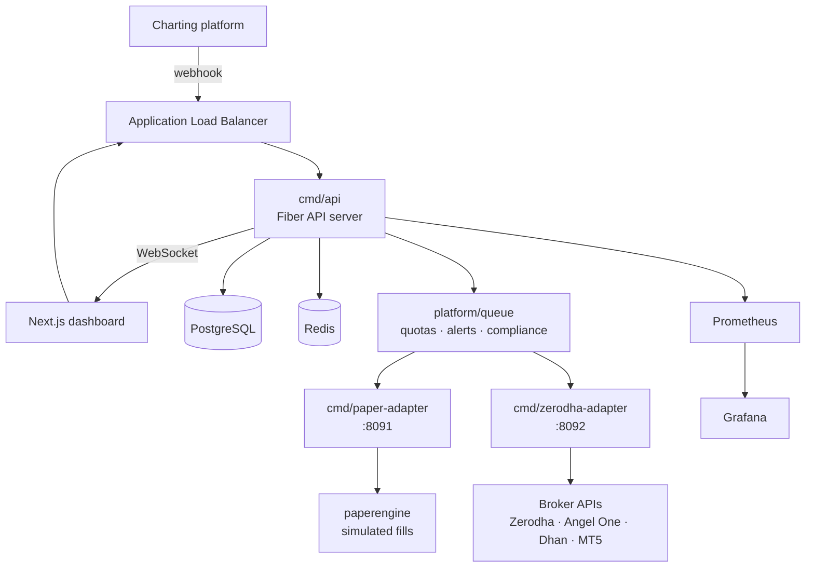

# ZettaBridge

Multi-tenant order execution platform that turns inbound webhook signals into live broker orders — with per-tenant credential isolation, idempotent signal processing, and guard rules that stop a malformed signal before it reaches an exchange.

Built solo, end to end: Go backend, Next.js dashboard, AWS infrastructure, observability.

> **Status: archived.** This ran on AWS from January to June 2026 and has been shut down — the infrastructure is no longer deployed and the hosted dashboard is offline. The code and Terraform definitions are complete and reproducible.

**~33,000 lines of Go** (44,800 including tests) · 79 test files · 60 Terraform resource blocks · 4 broker integrations

---

## The problem

Automated trading signals originate in charting platforms that can only emit an HTTP webhook. Brokers expose authenticated REST APIs with different auth models, order schemas, symbol formats and rate limits. Getting from one to the other reliably needs a service that:

- authenticates against several broker APIs on behalf of different users, without ever storing credentials in a form a database leak would expose
- refuses to fire a duplicate order when a webhook is delivered twice — because webhook delivery is retried on timeout, and a retried buy signal is a second buy order
- enforces per-user limits so a malformed or runaway signal can't drain an account
- tells the user what happened, live, while it's happening

The interesting engineering isn't the trading. It's that every one of those requirements is a correctness problem where the failure mode costs someone real money.

---

## Architecture

Three Go services behind an ALB, with execution split out from the API so that a slow or failing broker can't block signal ingestion.



| Service | Role |
|---|---|
| `cmd/api` | HTTP API, auth, webhook ingestion, guard evaluation, WebSocket hub |
| `cmd/paper-adapter` | Simulated execution — fill engine and end-of-day square-off |
| `cmd/zerodha-adapter` | Live execution, OAuth flow, fill polling, publisher callbacks |

Splitting execution into adapter sidecars means broker OAuth token refresh and fill-polling run outside the request path. The API stays responsive when a broker is slow, and a broker integration can be restarted without dropping inbound signals.

---

## What's inside

**Broker abstraction.** Every broker implements three methods:

```go
type Broker interface {
    PlaceOrder(ctx context.Context, req *PlaceRequest) (*OrderResult, error)
    CancelOrder(ctx context.Context, req *CancelRequest) error
    GetAccountEquity(ctx context.Context) (float64, error)
}
```

Four live implementations (Zerodha, Angel One, Dhan, MT5) plus a simulated broker, behind a factory. Adding a broker means implementing the interface, adding a factory case, and adding credential parsing — the core never learns broker-specific concepts.

**Credential encryption.** AES-256-GCM, with the credential's own ID as the GCM additional authenticated data, so a ciphertext lifted from one row can't be replayed against another. Blobs are versioned (`v1:` prefix) to allow scheme migration. Credentials are decrypted on demand at the point of use and never cached in memory between requests.

**Idempotent signal processing.** Signals are hashed on content — webhook ID, action, symbol, lot size, comment — deliberately *excluding* timestamps, so a retried delivery produces an identical key. Deduplication uses an atomic Redis `SET NX EX` within a per-webhook window (default 2s, configurable to 60s), checked at ingestion and re-checked in the queue before execution.

**Guard rules**, evaluated before anything reaches a broker: allowed actions and symbols, required comment matching, trading-hours windows, maximum lot size, per-second and per-minute rate limits, daily caps on the free plan, and market-hours enforcement on the paper path.

**Multi-tenancy** runs through plan limits, org- and webhook-level compliance gating, and per-credential live-vs-paper routing policy.

---

## Infrastructure

Terraform provisions the full stack — 60 resource blocks across 34 types:

| Layer | Resources |
|---|---|
| Networking | VPC, public/private subnets, IGW, NAT gateway, EIP, route tables |
| Load balancing | ALB, 3 listeners, 4 listener rules, 3 target groups |
| Compute | ECS Fargate cluster, 3 services, 3 task definitions, service discovery |
| Data | RDS PostgreSQL, ElastiCache Redis, subnet and parameter groups |
| Registry | 2 ECR repositories with lifecycle policies |
| DNS/TLS | ACM certificate with DNS validation, Route 53 records |
| Monitoring | 4 CloudWatch alarms, log group, SNS topic and subscription |
| Security | 4 security groups, 2 IAM roles, Secrets Manager |

An alternative Lightsail deployment using Docker Compose, Prometheus, Grafana and Alertmanager lives in `deploy/deploy-lightsail/`.

---

## Things that turned out to matter

**Webhook delivery is not exactly-once.** Charting platforms retry on timeout, and there's no stable request ID to deduplicate on. The key had to be derived from signal *content* and deliberately exclude time — which means the deduplication window becomes a real tradeoff: too short and retries double-fire, too long and a legitimate repeated signal gets swallowed. It ended up per-webhook and configurable, because the right answer differs by strategy.

**Broker APIs disagree about everything.** Order types, symbol formats, product codes, session lifetimes, error semantics, rate limits. The adapter interface went through several iterations before it stopped leaking broker-specific concepts into the execution core. Keeping it to three methods forced the broker-specific complexity into the adapters, where it belongs.

**Credentials shouldn't live in memory longer than a request.** Decrypt on use, never cache. It costs some latency on every order, and removes an entire category of exposure. Binding the ciphertext to its credential ID via GCM AAD came from the same instinct — make the encrypted blob useless outside its exact context.

**Separating execution from ingestion was the right call, late.** The API originally executed inline. Splitting execution into adapter sidecars decoupled broker latency and OAuth refresh cycles from signal ingestion, and made it possible to restart a broker integration without dropping signals.

---

## Testing

- **79 unit test files** across `internal/` — roughly 27% of the codebase is test code
- **Integration tests** in `internal/integration/`, httptest-based
- **Load and resilience testing** with k6 in `deploy/loadtest/` — smoke, ramp, target-load, dedup-under-load, soak, bracket-order and rate-limit scenarios
- **Security test scripts** in `deploy/sectest/`

The dedup-under-load scenario exists because duplicate suppression is the one behaviour that has to hold under concurrency — a deduplication check that races is worse than none.

---

## Running locally

```bash
git clone https://github.com/SPSingh09/zettabridge-public.git
cd zettabridge-public

cp .env.example .env              # fill in values
docker compose up -d              # PostgreSQL + Redis

go run ./cmd/api                  # API on :8080
go run ./cmd/paper-adapter        # paper execution on :8091

cd dashboard && npm install && npm run dev
```

API documentation is generated into `swagger/` and served at `/swagger` when the API is running. The Bruno collection in `bruno/` covers the full API surface.

## Deploying

```bash
cd deploy/deploy-aws-ecs/terraform/staging
cp terraform.tfvars.example terraform.tfvars    # fill in values
terraform init && terraform plan
```

---

## Repository layout

```
cmd/                    Service entrypoints (api, paper-adapter, zerodha-adapter)
internal/
  domain/               Core types and the Broker interface
  execution/            Orchestration, routing, command building
  integrations/brokers/ Broker clients, factory, order mapping, symbol cache
  platform/             crypto · security · queue · metrics · migrate · mailer
  modules/              HTTP handlers by domain
  guard/                Signal validation and market-hours checks
  store/                PostgreSQL and Redis data access
dashboard/              Next.js + TypeScript + Tailwind
migrations/             Sequential SQL migrations
deploy/                 Terraform (ECS), Lightsail, load tests, security tests
functional-tester/      End-to-end functional test harness
docs/                   Architecture documentation and diagrams
```

Further architecture detail, including additional diagrams, is in [`docs/architecture-diagrams.md`](docs/architecture-diagrams.md) and [`docs/02-architecture/system-architecture.md`](docs/02-architecture/system-architecture.md).

---

## License

MIT — see [LICENSE](LICENSE).

Provided as-is, with no warranty. This is engineering work, not financial advice, and not a supported product.
