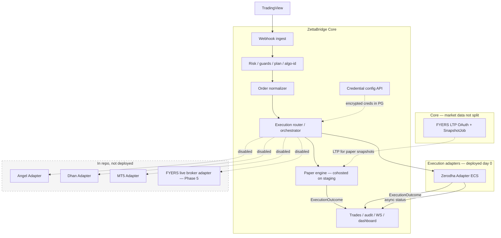
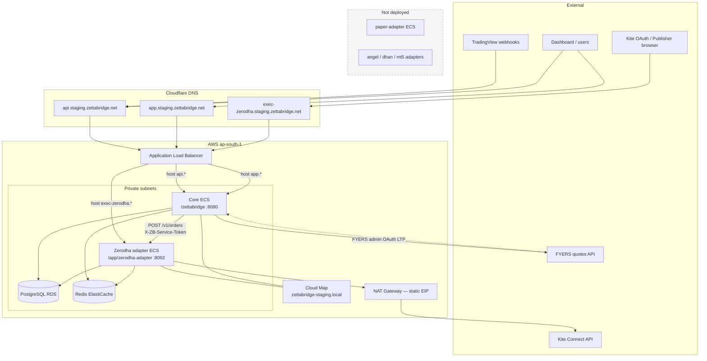
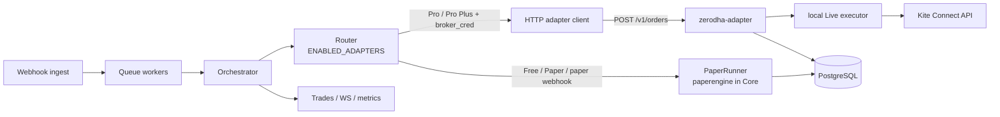
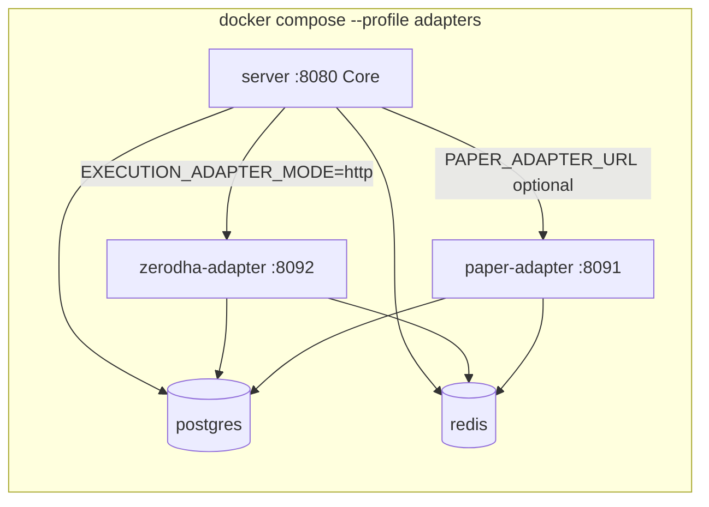
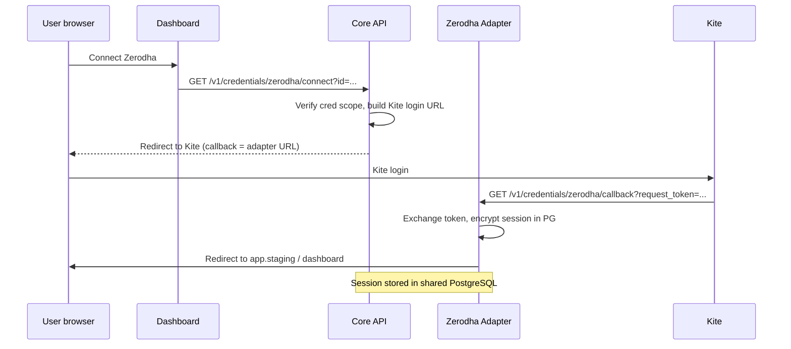
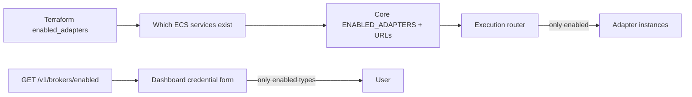
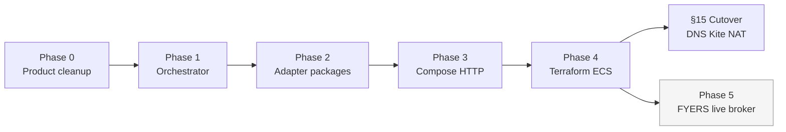
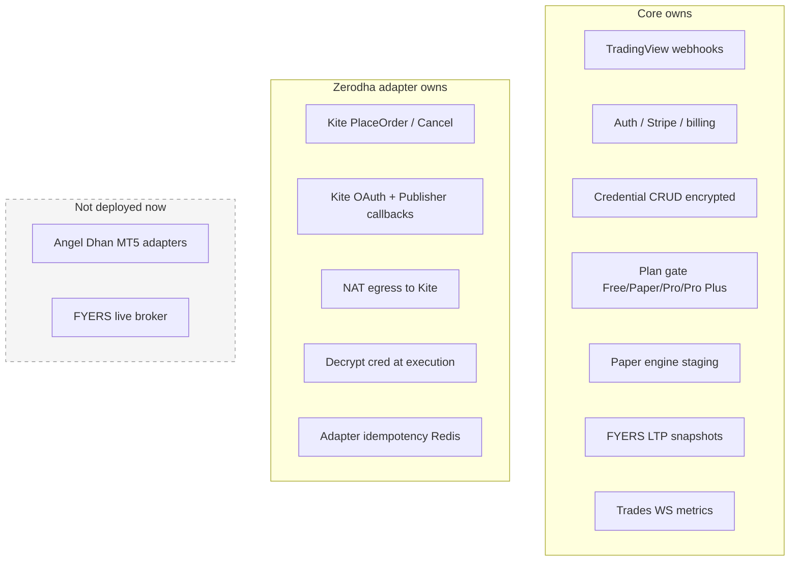

# ZettaBridge Architecture Diagrams

**Exported:** 2026-07-07  
**Scope:** Staging — **paper + Zerodha live** via HTTP adapters. Angel/Dhan/MT5/FYERS live broker **not deployed**.  
**Source:** [STATUS.md](STATUS.md) + current implementation (Phase 0, adapter split partial).

---

## How to export as PNG / SVG

These diagrams use [Mermaid](https://mermaid.js.org/). To render or export:

| Method | Steps |
|--------|--------|
| **GitHub / GitLab** | Push this file — Mermaid renders in the markdown preview |
| **VS Code / Cursor** | Install “Markdown Preview Mermaid Support”, open preview |
| **mermaid.live** | Copy a ` ```mermaid ` block → paste at [mermaid.live](https://mermaid.live) → Export PNG/SVG |
| **CLI** | `npx @mermaid-js/mermaid-cli -i diagram.mmd -o diagram.png` |

---

## 1. Logical overview (two service classes)

High-level split: Core vs Execution Adapters vs market-data on Core.



---

## 2. Staging AWS (Zerodha live target)

`execution_adapter_mode=http`, `paper_adapter_cohosted=true`, `enabled_adapters=paper,zerodha`.



---

## 3. Order execution path (inside Core)



**Plan gates (four tiers):**

| Plan | Paper webhooks | Live webhooks |
|------|----------------|---------------|
| Free | 1 | 0 |
| Paper | 5 | 0 |
| Pro | 8 | 1 |
| Pro Plus | 15 | 5 |

Live Zerodha requires Pro/Pro Plus + `broker_cred_id` when `EXECUTION_ADAPTER_MODE=http` and `BROKER_MODE=live`.

---

## 4. Local dev (`make compose-http`)



**Note:** Staging cohosts paper in Core (`paper_adapter_cohosted=true`). Local compose may still run a paper sidecar when `PAPER_ADAPTER_URL` is set.

---

## 5. Zerodha OAuth connect flow (http mode)

Core does not receive Kite `request_token` on the public internet — only the adapter does.



Publisher handoff: synchronous `handoff` in order response → user confirms basket on Kite → Kite redirects to **adapter** `/v1/publisher/callback`.

---

## 6. Three-layer adapter gating



| Layer | Mechanism | Day-0 value |
|-------|-----------|-------------|
| Terraform | `enabled_adapters` → ECS `for_each` | `["paper","zerodha"]` → **zerodha-adapter ECS only** |
| Core runtime | `ENABLED_ADAPTERS` + adapter URLs | Router rejects disabled brokers |
| Product API | `/v1/brokers/enabled` | Dashboard hides Angel/Dhan/MT5 |

---

## 7. Implementation phases (timeline)



---

## 8. Responsibility matrix (quick reference)



---

## 9. Config reference (day-0 staging)

```env
ENABLED_ADAPTERS=paper,zerodha
EXECUTION_ADAPTER_MODE=http
paper_adapter_cohosted=true                    # Terraform variable
ZERODHA_ADAPTER_URL=https://exec-zerodha.staging.zettabridge.net
ZB_SERVICE_TOKEN=...                           # Core ↔ adapter
BROKER_MODE=live                               # after NAT IP whitelisted
```

---

## Related docs

- [STATUS.md](STATUS.md) — canonical product snapshot
- [diagrams/README.md](diagrams/README.md) — customer-facing product diagrams (webhook flows, Publisher, compliance)
- [scope.md](01-product/scope.md) — in/out of scope
- [deploy/deploy-aws-ecs/terraform/staging/README.md](../deploy/deploy-aws-ecs/terraform/staging/README.md) — Phase 4 Terraform
