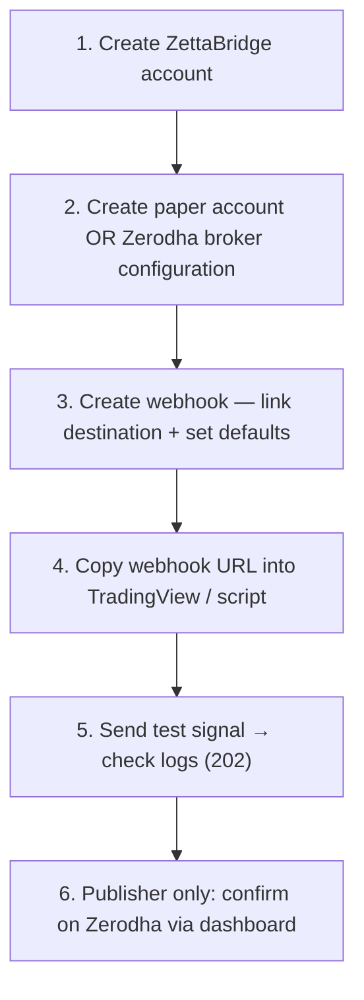
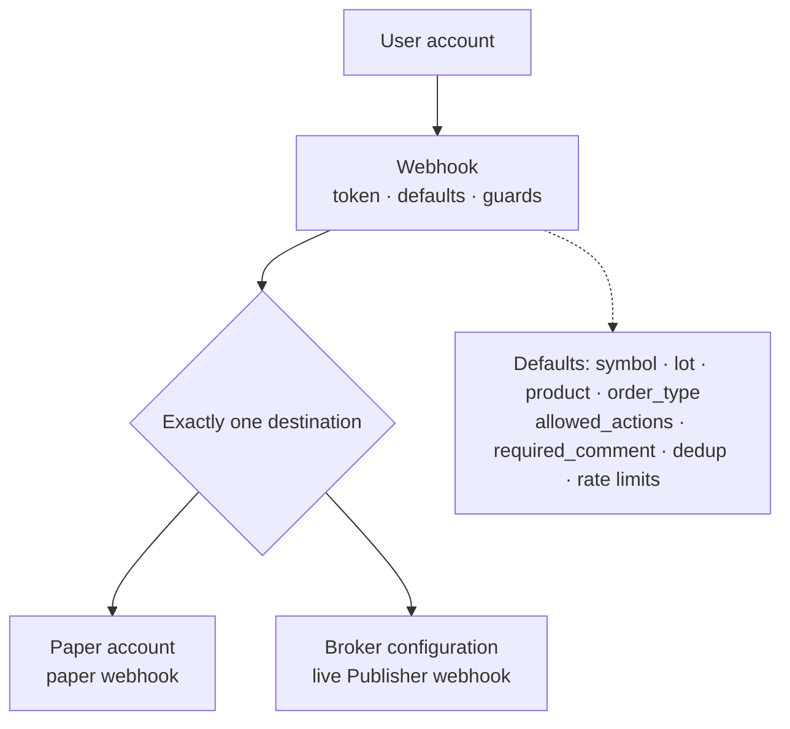
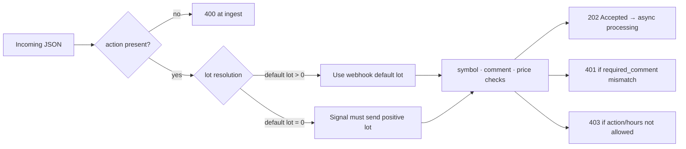
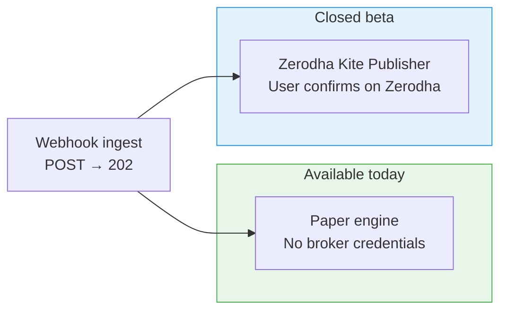

# Configuration & Onboarding Diagrams

**Last updated:** July 2026

Setup order, webhook model, payload rules, and supported workflows.

[← Back to diagram index](README.md)

---

## 1. First-time setup map

Recommended: validate with paper trading before enabling a live Publisher webhook.

**Checklist**

1. Create ZettaBridge account
2. Create paper account **or** Zerodha broker configuration
3. Create webhook — link destination + set defaults
4. Copy webhook URL into TradingView / script / bot
5. Send test signal → verify **202** in logs
6. **Publisher only:** confirm on Zerodha via dashboard

---

## 2. Webhook configuration model

Each webhook links to exactly one destination. One webhook URL = one token.

**Configuration fields (defaults & guards)**

| Category | Examples |
|----------|----------|
| Identity | Hashed token, webhook name |
| Destination | Paper account ID **or** broker configuration ID |
| Defaults | `symbol`, `lot`, `product`, `order_type` |
| Guards | `allowed_actions`, `required_comment`, trading hours |
| Limits | Dedup window, per-webhook rate limit |

---

## 3. Signal payload resolution

Only `action` is always required at ingest. Other fields fall back to webhook defaults.

**Field rules**

| Field | Rule |
|-------|------|
| `action` | **Required.** `BUY` / `SELL` / `CLOSE`. Publisher webhooks: `BUY` & `SELL` only at config level. |
| `lot` | If webhook default `lot > 0`, default wins. If default is `0`, signal must send positive `lot`. |
| `symbol` | When provided, must match allowed symbol list. May reject **after** 202. |
| `comment` | When `required_comment` is set, must match exactly — else **401** at ingest. |
| `price` | Omit or `0` for market-style orders, subject to webhook settings. |

---

## 4. Supported workflows matrix

Zerodha OAuth and Kite Connect are **not** available on the public platform today.

| Workflow | Auth | User action | Status |
|----------|------|-------------|--------|
| Paper engine | None | None | **Available** |
| Zerodha Kite Publisher | No OAuth session stored for Publisher handoff | Confirm on Zerodha | **Closed beta** |

**Out of scope (public platform today)**

- Kite Connect OAuth live order flow
- Angel One, Dhan, MT5 live adapters (in repo, not publicly deployed)
- Discretionary trading or investment advice
