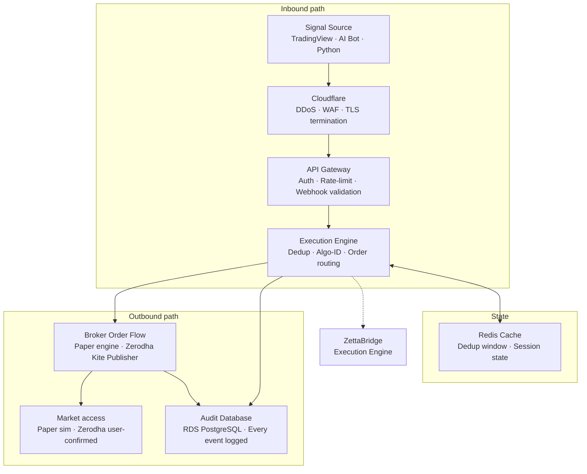
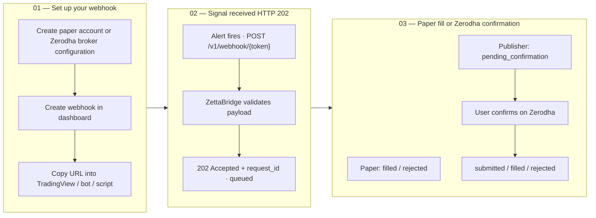
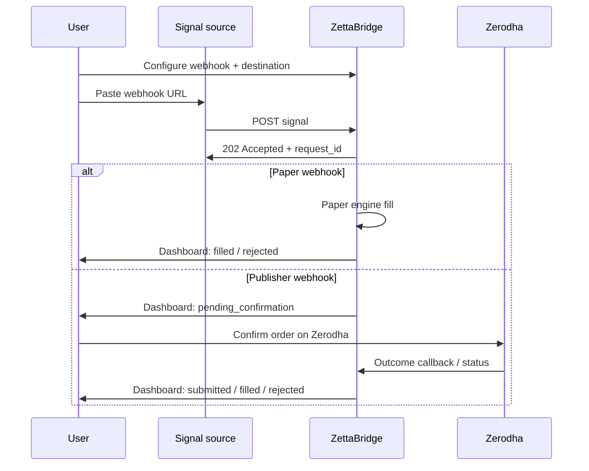

# Customer Architecture Diagrams

**Last updated:** July 2026

Homepage-style architecture and onboarding flows — customer-facing view of the execution stack.

[← Back to diagram index](README.md)

---

## 1. Enterprise execution stack

Every signal traverses a hardened infrastructure path — from Cloudflare at the edge to the audit database at the end.

Internal validation and routing optimized for low latency. Broker, exchange, and user-confirmation latency may vary.



**Stack layers**

| Layer | Description |
|-------|-------------|
| Signal Source | TradingView · AI Bot · Python |
| Cloudflare | DDoS · WAF · TLS termination |
| API Gateway | Auth · Rate-limit · Webhook validation |
| Execution Engine | Dedup · Algo-ID · Order routing |
| Redis Cache | Dedup window · Session state |
| Broker Order Flow | Paper engine · Zerodha Kite Publisher |
| Market access | Paper sim · Zerodha (user-confirmed) |
| Audit Database | RDS PostgreSQL · Every event logged |

**Key metrics (customer-facing)**

| Metric | Value |
|--------|-------|
| Internal processing | Fast (async after 202) |
| Credential encryption | AES-256-GCM |
| Default dedup window | 2 s |

For deployment topology (ECS, adapters, NAT), see [architecture-diagrams.md](../architecture-diagrams.md).

---

## 2. Three steps: signal to outcome

End-user journey from webhook setup to paper fill or Zerodha Publisher confirmation.



**Step detail**

### 01 — Set up your webhook

Create a paper account or Zerodha broker configuration, then create a webhook in the dashboard. Copy the URL into TradingView, your AI bot, or a Python script.

```json
POST /v1/webhook/{token}
{
  "action": "BUY",
  "symbol": "RELIANCE",
  "lot": 1
}
```

### 02 — Signal received — HTTP 202

When your alert fires, ZettaBridge validates the payload and returns **202 Accepted** with a `request_id`. The signal is queued for processing — not executed synchronously in the response.

```json
HTTP 202 Accepted
{
  "status": "accepted",
  "request_id": "req_...",
  "queued": true
}
```

### 03 — Paper fill or Zerodha confirmation

Paper webhooks update your paper account. Zerodha Kite Publisher webhooks move to `pending_confirmation` — you complete the order on Zerodha via the dashboard. Full audit trail is logged.

```
Paper:        filled / rejected
Publisher:    pending_confirmation → user confirms on Zerodha
```

---

## Sequence view (all three steps)


