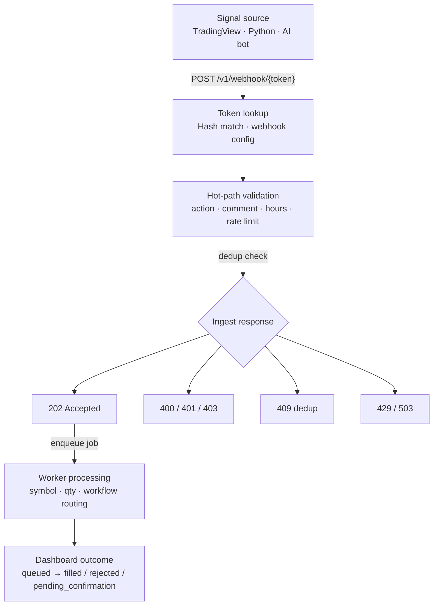
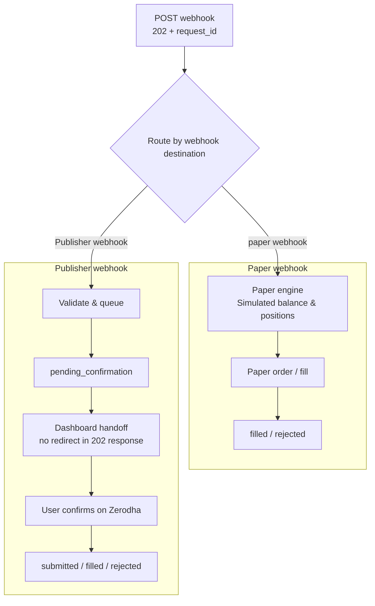
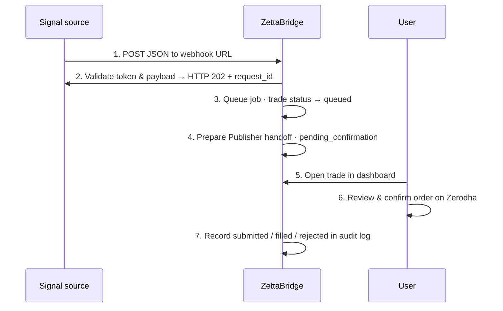
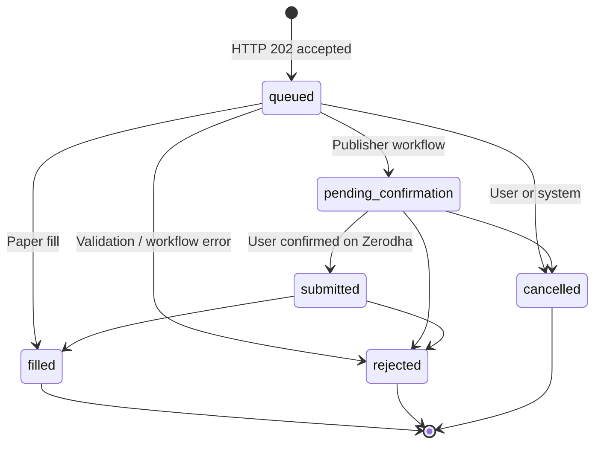

# Execution Flow Diagrams

**Last updated:** July 2026

How signals move from ingest to paper or Zerodha Kite Publisher outcomes.

[← Back to diagram index](README.md)

---

## 1. Webhook ingest sequence

Synchronous validation at ingest. Processing continues asynchronously after HTTP 202.

**Notes**

- Ingest is **not** synchronous order execution — 202 means accepted and queued.
- Rejections at ingest return 4xx immediately; some validation (e.g. symbol) may fail **after** 202.
- Save `request_id` from the 202 response for support and dashboard correlation.

---

## 2. Paper vs Zerodha Kite Publisher

Same webhook ingest path. Destination is determined by **webhook configuration** — not the signal payload.

**Notes**

- One webhook URL links to exactly one destination (paper account **or** broker configuration).
- Publisher never returns a Zerodha redirect URL in the webhook HTTP response.
- Paper outcomes resolve inside ZettaBridge; Publisher requires user action on Zerodha.

---

## 3. Kite Publisher confirmation flow

ZettaBridge never stores your Zerodha login password. Live orders require your confirmation on Zerodha.

**Step reference**

| Step | Actor | Action |
|------|-------|--------|
| 1 | Signal source | POST JSON to webhook URL |
| 2 | ZettaBridge | Validate token & payload → HTTP 202 + `request_id` |
| 3 | ZettaBridge | Queue job · trade status → `queued` |
| 4 | ZettaBridge | Prepare Publisher handoff · `pending_confirmation` |
| 5 | User | Open trade in dashboard |
| 6 | User | Review & confirm order on Zerodha |
| 7 | ZettaBridge | Record `submitted` / `filled` / `rejected` in audit log |

---

## 4. Trade status lifecycle

Some rejections occur after HTTP 202 — check `error_code` on rejected trades.

**Status reference**

| Status | Meaning |
|--------|---------|
| `queued` | Signal accepted & queued |
| `pending_confirmation` | Publisher only — awaiting user on Zerodha |
| `submitted` | Submission recorded |
| `filled` | Paper fill or broker confirmation |
| `rejected` | Validation or workflow error |
| `cancelled` | User or system cancelled |

**Typical Publisher path:** `queued` → `pending_confirmation` → `submitted` → `filled` (or `rejected` at any stage).

Poll status via **`GET /v1/trades/{id}`**.
