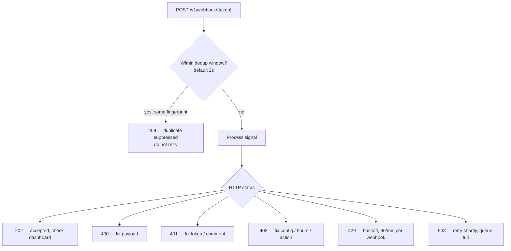
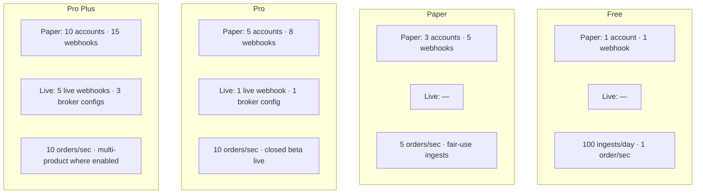

# Operations & Plans Diagrams

**Last updated:** July 2026

Retry behaviour, deduplication, and plan limit overview.

[← Back to diagram index](README.md)

---

## 1. Deduplication & retry behaviour

409 means the duplicate was suppressed — the original signal may still be processing.

| HTTP | Retry? | Notes |
|------|--------|-------|
| **202** | No | Accepted — check dashboard for final trade status |
| **400** | Fix payload | Malformed JSON or missing `action` |
| **401** | Fix token / comment | Invalid token or `required_comment` mismatch |
| **403** | Fix config | Paused webhook, action not allowed, outside hours |
| **409** | No | Duplicate suppressed within dedup window (default **2s**) |
| **429** | Yes + backoff | **60/min** per webhook; free plan **100/day** |
| **503** | Yes + delay | Queue full — retry shortly |

**Defaults**

- Dedup window: **2 seconds**
- Per-webhook rate limit: **60 requests/minute**
- Free plan daily ingest cap: **100 requests/day**

---

## 2. Plan limits overview

Live broker workflows require eligible plan + closed-beta approval. Per broker configuration cap: **10 orders/sec**.

| Plan | Paper | Live | Limits |
|------|-------|------|--------|
| **Free** | 1 account · 1 webhook | — | 100 ingests/day · 1 order/sec |
| **Paper** | 3 accounts · 5 webhooks | — | 5 orders/sec · fair-use ingests |
| **Pro** | 5 accounts · 8 webhooks | 1 live webhook · 1 broker config | 10 orders/sec · closed beta live |
| **Pro Plus** | 10 accounts · 15 webhooks | 5 live webhooks · 3 broker configs | 10 orders/sec · multi-product where enabled |

**Notes**

- Live Zerodha Publisher requires **Pro** or **Pro Plus** plus closed-beta approval.
- Plan gates are enforced at webhook creation and at ingest routing.
- See [payments.md](../04-integrations/payments.md) for billing detail.
