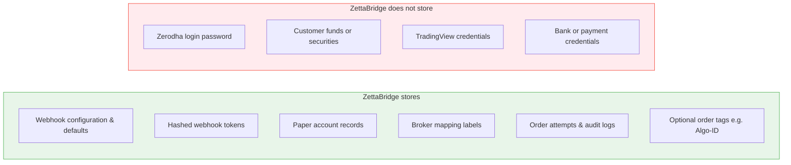
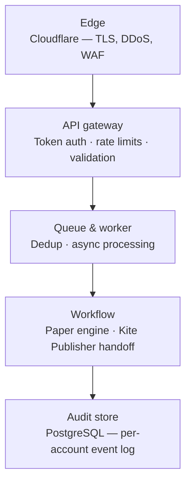
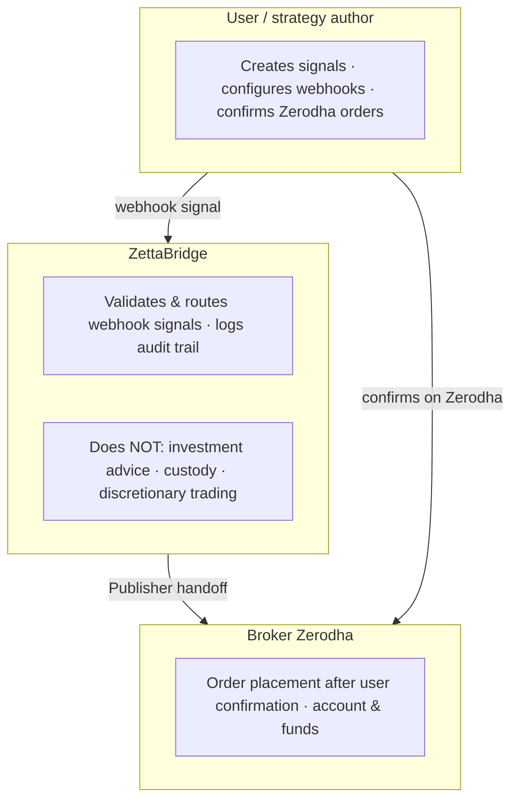
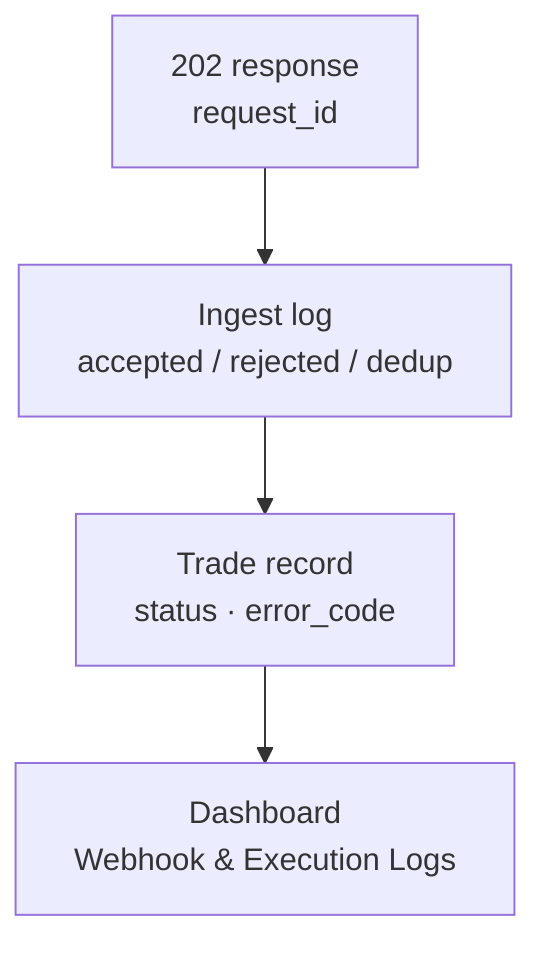

# Trust, Security & Compliance Diagrams

**Last updated:** July 2026

Data boundaries, security path, compliance roles, and support tracing.

[← Back to diagram index](README.md)

---

## 1. Data boundary — what we store

ZettaBridge stores configuration and audit data needed to operate the service — not your broker login.

| Stores | Does not store |
|--------|----------------|
| Webhook configuration & defaults | Zerodha login password |
| Hashed webhook tokens | Customer funds or securities |
| Paper account records | TradingView credentials |
| Broker mapping labels | Bank or payment credentials |
| Order attempts & audit logs | |
| Optional order tags (e.g. Algo-ID) | |

See also [security-architecture.md](../03-security/security-architecture.md) for encryption and secrets handling.

---

## 2. Security path (customer-facing)

Simplified request path. Internal service names omitted.

| Layer | Responsibility |
|-------|----------------|
| Edge | Cloudflare — TLS termination, DDoS, WAF |
| API gateway | Webhook token auth, rate limits, hot-path validation |
| Queue & worker | Dedup window, async job processing |
| Workflow | Paper engine or Kite Publisher handoff |
| Audit store | PostgreSQL — ingest logs, trades, execution events |

For internal adapter topology and NAT egress, see [architecture-diagrams.md](../architecture-diagrams.md).

---

## 3. Compliance role boundary

ZettaBridge is an execution router — not a broker or investment adviser.

| Role | Does | Does not |
|------|------|----------|
| **User / strategy author** | Creates signals, configures webhooks, confirms Zerodha orders | — |
| **ZettaBridge** | Validates & routes webhook signals, logs audit trail | Investment advice, custody, discretionary trading |
| **Broker (Zerodha)** | Order placement after user confirmation, account & funds | — |

See [sebi-compliance.md](../09-compliance-and-legal/sebi-compliance.md) for Algo-ID posture.

---

## 4. Audit trail tracing

Save `request_id` from the 202 response when contacting support.

**Tracing chain**

1. **202 response** — capture `request_id` at signal source
2. **Ingest log** — `accepted`, `rejected`, or dedup suppressed
3. **Trade record** — `status`, `error_code` after async processing
4. **Dashboard** — Webhook & Execution Logs for the account

Support requests should include `request_id` and approximate signal timestamp.
