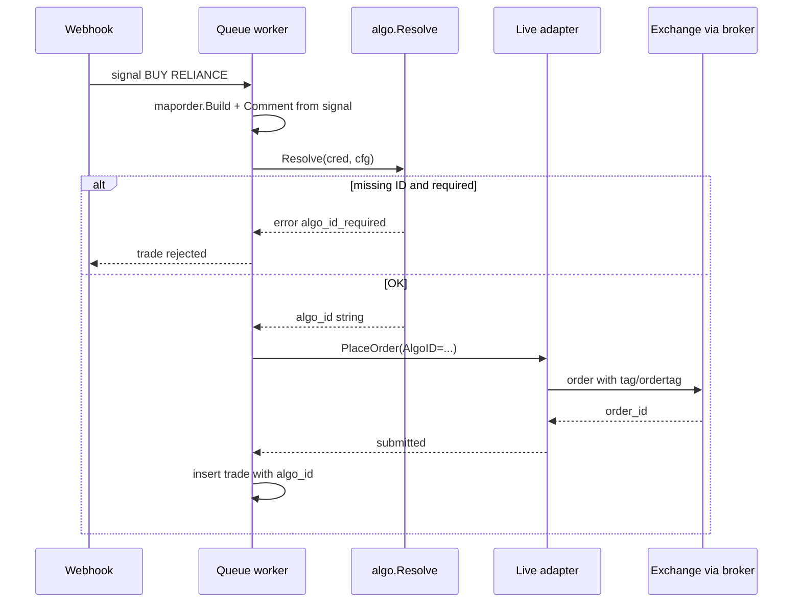
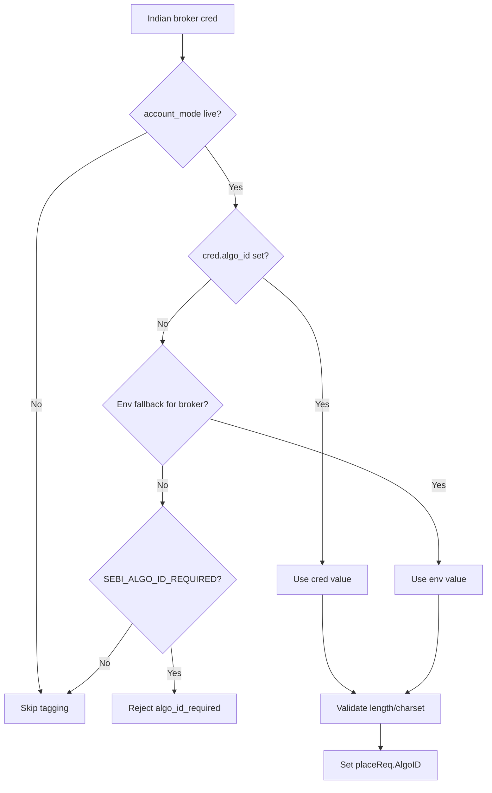

# PR 3.2 — SEBI Algo-ID tagging

> **Historical implementation plan.** Current product behavior is defined in [STATUS.md](../STATUS.md) and [scope.md](../01-product/scope.md). Last reviewed: 2026-07-07.

Plan for tagging every **live Indian broker order** with the exchange-assigned algorithm identifier required under SEBI/NSE retail algo rules.

**Roadmap:** [roadmap.md](../roadmap.md#pr-32--sebi-algo-id) · **Status:** Implemented (Zerodha/Angel/Dhan)

---

## Why this is needed

### Regulatory

From **August 2025** onward, NSE/SEBI require API-originated algo orders to carry an **exchange-assigned unique identifier** so brokers and exchanges can audit order flow. Retail clients at or below the **10 orders-per-second (OPS)** threshold may use a **generic algo ID** issued via the broker; above the threshold, algos must be **registered** and tagged with a **unique ID**.

ZettaBridge is an API bridge: every webhook-triggered NSE/BSE order is an algo order in regulator terms. Shipping Indian **live** execution without tagging is a compliance gap and a blocker for **5C.2** (flip staging → live brokers) in [roadmap.md](../roadmap.md).

### Product

Roadmap principle #5: **Indian compliance before Indian live scale**. Marketing live NSE/BSE should not happen until this PR ships.

### Current gap

Indian live adapters place market orders **without** any algo/tag field:

```28:36:internal/livebrokers/zerodha.go
func (b *ZerodhaBroker) placeMarketOrder(ctx context.Context, txnType string, req *broker.PlaceRequest) (*broker.OrderResult, error) {
	payload := map[string]interface{}{
		"tradingsymbol":    req.Symbol,
		"exchange":         req.Exchange,
		"transaction_type": txnType,
		"order_type":       "MARKET",
		"product":          req.Product,
		"quantity":         int(req.Quantity),
	}
```

Angel and Dhan payloads are the same — no `ordertag` / algo field.

`broker.PlaceRequest` already has `Comment`, populated from the webhook signal for **dedup and MT5**:

```267:267:internal/queue/queue.go
	placeReq.Comment = sig.Comment
```

That field is **not** the SEBI algo ID. TradingView comments are user-defined, unbounded, and optional; SEBI IDs are operator-configured, broker-validated, and mandatory for live Indian orders.

---

## Goals (v1)

| Goal | v1 behavior |
|------|-------------|
| Tag live Indian orders | Zerodha, Angel, Dhan adapters send broker-specific algo/tag field |
| Configurable ID source | Per-credential `algo_id` with server env fallback |
| Fail closed in prod | Reject live Indian execution when ID missing and enforcement on |
| Demo/mock unchanged | No tag required for `account_mode: demo` or `BROKER_MODE=mock` |
| Audit trail | Persist resolved algo ID on `trades` row |
| Operator docs | broker-guide + runbook for obtaining ID from broker |

### Non-goals (v1)

- Algo **registration workflow** with NSE/broker (user obtains ID out of band)
- Per-webhook algo ID override (defer unless product needs multi-strategy on one cred)
- Zerodha `market_protection` / static IP setup (separate ops; cross-link only)
- Using webhook `comment` as algo ID
- MT5 / forex tagging

---

## Regulatory context (operator summary)

| Topic | Implication for ZettaBridge |
|-------|----------------------------|
| **Who needs an ID?** | All API algo orders on NSE/BSE (including unregistered ≤10 OPS) |
| **Generic vs unique** | ≤10 OPS → generic ID from broker/exchange; >10 OPS → registered unique ID |
| **Who obtains it?** | End user registers with broker; broker communicates exchange-assigned ID |
| **Static IP** | Required for direct API (Angel/Dhan whitelist, Zerodha Kite Connect dashboard) — already documented in [broker-guide.md](../broker-guide.md) |
| **ZettaBridge OPS** | Well below 10 OPS per user; generic ID is the common case |

**Important:** Exact numeric format (e.g. NSE generic patterns) is **broker-specific**. ZettaBridge stores and forwards the string the broker issued — we do not synthesize IDs.

---

## Per-broker field mapping

| Broker | API field | JSON key | Max length | Charset | Notes |
|--------|-----------|----------|------------|---------|-------|
| **Zerodha** | Kite `tag` | `"tag"` | 20 | Alphanumeric (Kite docs) | Used for SEBI algo ID per [Kite forum](https://kite.trade/forum/discussion/15924/sdk-update-to-pass-algo-id); also on modify/cancel if added later |
| **Angel** | SmartAPI `ordertag` | `"ordertag"` | 20 | Per SmartAPI validation | Must repeat same tag on modify (future 3.4) |
| **Dhan** | `correlationId` | `"correlationId"` | 30 | Alphanumeric | Confirmed by Dhan support: pass Algo ID in `correlationId` field. ≤10 OPS generic ID available via Dhan support; >10 OPS requires Algo Provider registration. |

### Dhan spike — resolved

**Outcome:** Dhan support confirmed `correlationId` is the correct request field for passing the SEBI Algo ID. ZettaBridge sends it as `correlationId` on every live Dhan order when `algo_id` is set on the credential (max 30 alphanumeric chars). Public v2 docs referred to `correlationId` as "user tracking" — Dhan support clarified it doubles as the algo ID field for SEBI compliance purposes.

---

## Recommended config model

**Per-credential primary, env fallback secondary.**

| Source | Precedence | Use case |
|--------|------------|----------|
| `broker_credentials.algo_id` | 1 (highest) | Each user/org has their own registered ID |
| `BROKER_ZERODHA_ALGO_ID` / `BROKER_ANGEL_ALGO_ID` / `BROKER_DHAN_ALGO_ID` | 2 | Platform default for early bird / single-tenant staging |
| Reject | — | When `SEBI_ALGO_ID_REQUIRED=true` and Indian + live + empty |

### Environment variables

| Variable | Default | Purpose |
|----------|---------|---------|
| `SEBI_ALGO_ID_REQUIRED` | `true` when `BROKER_MODE=live`, else `false` | Fail closed on missing ID |
| `BROKER_ZERODHA_ALGO_ID` | empty | Fallback for Zerodha |
| `BROKER_ANGEL_ALGO_ID` | empty | Fallback for Angel |
| `BROKER_DHAN_ALGO_ID` | empty | Fallback for Dhan |

Functional CI: `SEBI_ALGO_ID_REQUIRED=false` in `docker-compose.yml` (mirrors email verification pattern).

### Why not webhook `comment`?

- Optional — dedup allows different comments for same action
- User-controlled — not suitable for compliance
- Length/format differs from broker limits (20 chars)

---

## Design

### New internal field

Add `AlgoID string` to `broker.PlaceRequest` (separate from `Comment`).

Resolution helper (new package or `internal/algo/`):

```go
// Resolve returns trimmed algo ID for Indian live cred, or "" when not applicable.
func Resolve(cred *store.BrokerCredential, cfg *config.Config) (string, error)
```

Rules:

- Return `""` for `mt5_cloud`, demo mode, mock factory — no error
- For `zerodha|angel|dhan` + live: `cred.AlgoID` → env fallback → error if required and still empty
- Validate length ≤20 (Zerodha/Angel); Dhan TBD after spike
- Validate charset before send (reject early with `invalid_credentials` / dedicated `algo_id_invalid`)

### Where to resolve

**Queue worker** (single enforcement point):

```text
maporder.Build → WithAction → resolve AlgoID → placeReq.AlgoID = id → PlaceOrder
```

Reject before HTTP call:

```text
trade rejected, error_code=algo_id_required, message=public hint linking to broker-guide
```

Optional **credential API** validation on POST/PUT: reject creating/updating `account_mode: live` Indian cred without resolvable algo ID when enforcement on (fail fast at setup time).

### Adapter changes

| File | Change |
|------|--------|
| `internal/livebrokers/zerodha.go` | Add `"tag": req.AlgoID` when non-empty |
| `internal/livebrokers/angel.go` | Add `"ordertag": req.AlgoID` in both place paths |
| `internal/livebrokers/dhan.go` | Add `"correlationId": req.AlgoID` when non-empty |
| `internal/mockbrokers/{zerodha,angel,dhan}.go` | Assert/copy tag for parity in mock path (optional) |

Shared helper in `livebrokers`:

```go
func indianOrderTag(req *broker.PlaceRequest) string // returns req.AlgoID trimmed
```

### Database

**Migration `013_sebi_algo_id.sql`:**

```sql
ALTER TABLE broker_credentials
    ADD COLUMN IF NOT EXISTS algo_id TEXT;

ALTER TABLE trades
    ADD COLUMN IF NOT EXISTS algo_id TEXT;
```

- `broker_credentials.algo_id` — operator-configured, returned in credential GET (not secret)
- `trades.algo_id` — snapshot at execution time for audit

No backfill required for credentials (empty until user sets). Existing trades: NULL.

### API changes

**POST/PUT `/v1/credentials`**

```json
{
  "broker_type": "zerodha",
  "account_mode": "live",
  "algo_id": "4444444444440",
  "raw_creds": "api_key:access_token",
  "exchange": "NSE",
  "product": "MIS"
}
```

- Optional when `SEBI_ALGO_ID_REQUIRED=false`
- Required (directly or via env fallback) for Indian live when enforcement on
- Omit or empty for MT5 / demo

**GET credential response** — include `algo_id`.

**Admin** — no special endpoint v1; org admins use credential PUT.

### Config / infra

Extend `config.Config` + `livebrokers.Infra` (or pass `Config` into resolver) with fallback IDs and `SebiAlgoIDRequired`.

Wire in `cmd/api/main.go` startup log when enforcement enabled.

---

## Flow

### Order placement



### ID resolution



---

## Testing strategy

### Unit

- `algo.Resolve`: cred override, env fallback, demo skip, MT5 skip, required rejection
- Validation: empty, too long (>20), invalid charset

### Adapter (httptest)

Extend existing tests in `internal/livebrokers/*_test.go`:

- `TestZerodhaPlaceMarketOrder` — assert `body["tag"] == "TESTALGO123"`
- `TestAngelPlaceMarketOrder` — assert `ordertag` present
- `TestDhanPlaceMarketOrder` — assert per spike outcome

### Queue

- `queue_test.go`: Indian live + missing algo ID → rejected with `algo_id_required`
- Indian live + ID set → stub broker receives `PlaceRequest.AlgoID`

### Handler

- POST credential live Indian without algo_id → 400 when enforcement on
- POST with algo_id → 201

### Functional

- Default CI: `SEBI_ALGO_ID_REQUIRED=false` — no change to existing suite
- Optional subtest `TestSebiAlgoID` (env flag): mock/live httptest or log assertion

### Bruno

- Update `Credentials/create-zerodha-live.bru` with `algo_id`
- `Failure Modes/algo-id-missing.bru` — live Indian cred without ID → verify or webhook rejects

### Sandbox validation (manual, pre-5C.2)

| Broker | Check |
|--------|-------|
| Zerodha | Order book shows tag; order not rejected |
| Angel | Order book `ordertag` matches |
| Dhan | Response/postback `algoId` populated per broker registration |

---

## Rollout

| Environment | Settings |
|-------------|----------|
| Local dev | `SEBI_ALGO_ID_REQUIRED=false` or set test ID in `.env` |
| Functional CI | `SEBI_ALGO_ID_REQUIRED=false` |
| Staging | `SEBI_ALGO_ID_REQUIRED=true`, per-credential IDs from broker sandbox registration |
| Production | `SEBI_ALGO_ID_REQUIRED=true`; block 5C.2 until sandbox sign-off |

**Operator checklist (add to [broker-guide.md](../broker-guide.md)):**

1. Register for algo trading with broker (generic ID if ≤10 OPS).
2. Whitelist ZettaBridge NAT egress IP on broker dashboard.
3. Set `algo_id` on live credential (or platform env fallback for pilot).
4. Verify one order in broker console shows correct tag.

---

## Effort estimate

| Slice | Size |
|-------|------|
| Migration + store + API fields | 0.5 day |
| `algo.Resolve` + queue enforcement | 0.5 day |
| Zerodha + Angel adapter tagging | 0.25 day |
| Dhan spike + adapter | 0.25–0.5 day |
| Tests (unit + httptest + handler) | 0.5 day |
| Docs + Bruno + docker-compose | 0.25 day |
| **Total** | **~2–2.5 days** |

---

## Acceptance criteria

- [ ] Live Zerodha orders include `tag` with configured algo ID
- [ ] Live Angel orders include `ordertag` with configured algo ID
- [ ] Dhan path documented and implemented per spike (request field or broker-side note)
- [ ] Missing ID rejects trade (and optionally credential create) when `SEBI_ALGO_ID_REQUIRED=true`
- [ ] Demo/mock/MT5 unaffected
- [ ] `trades.algo_id` populated for tagged orders
- [ ] broker-guide section for obtaining and setting algo ID
- [ ] Functional CI passes with default env
- [ ] Sandbox smoke on at least one Indian broker before 5C.2

---

## Decisions (locked)

| # | Decision | Choice |
|---|----------|--------|
| 1 | Credential create gate vs queue-only | **Both** — reject live Indian cred without resolvable ID at POST/PUT; enforce again at queue |
| 2 | Env fallback | **Yes** — `BROKER_*_ALGO_ID` env vars as platform default for staging pilot |
| 3 | Error code | **Yes** — dedicated `algo_id_required` in `brokererr` + trade `error_code` |
| 4 | Dhan request field | **Spike before adapter** — see [Dhan spike — owner input](#dhan-spike--owner-input) |
| 5 | Algo ID on webhook | **Defer** — per-credential only for v1 |

---

## Dhan spike — owner input

Public DhanHQ v2 docs show `correlationId` on place-order (user tracking) and `algoId` only on **responses/postbacks** — not as a documented request field. We will **not** guess. One of the outcomes below is enough to finish the Dhan slice.

### What you can provide (pick any that apply)

| Option | What to send | Why it helps |
|--------|--------------|--------------|
| **A — Sandbox order proof** | Place one small live/sandbox order via Dhan API from your whitelisted IP; paste the **request JSON** you sent and the **full response JSON** (redact tokens) | Shows whether `algoId` appears without a request field → broker-side registration only |
| **B — Broker confirmation** | Email/ticket reply from Dhan support stating how API clients pass the SEBI algo ID (field name, or “attached to API key at registration”) | Authoritative without us holding your creds |
| **C — Partner docs** | Any Dhan partner/algo onboarding PDF or portal screenshot naming the request field | Fills gap if public docs are stale |

### If you do Option A (fastest)

1. Use a Dhan account with **algo/API access already enabled** (generic ≤10 OPS ID from broker if applicable).
2. Whitelist your egress IP on Dhan (same as production NAT flow).
3. `POST https://api.dhan.co/v2/orders` — minimal MARKET order (1 share, liquid NSE symbol).
4. Share:
   - Request body (did you include any algo/tag field?)
   - Response body (`algoId` present or `null`?)
   - Order book row or postback if available

### Outcomes we will implement from your answer

| Finding | ZettaBridge behavior |
|---------|---------------------|
| Request field exists (e.g. `algoId`) | Send it in `dhan.go` like Zerodha/Angel |
| No request field; `algoId` populated in response | Document operator steps: register algo with Dhan, set `algo_id` on cred for audit only; adapter skips request field |
| Orders rejected without broker-side registration | Document prerequisite in broker-guide; credential verify can surface broker error |

**Until A/B/C is done:** implement Zerodha + Angel + shared resolver/queue/API; leave Dhan adapter as no-op tag with a doc note, or gate Dhan live behind `BROKER_DHAN_ALGO_ID` + documented broker registration only.

---

## Related

- [roadmap.md](../roadmap.md) — Phase 3.2, blocks 5C.2
- [broker-guide.md](../broker-guide.md) — credentials, static IP, token refresh
- [operations-security.md](../operations-security.md) — NAT egress verification
- [plans/email-verification.md](email-verification.md) — similar env-gated compliance PR pattern
- NSE circular [INVG67858](https://nsearchives.nseindia.com/content/circulars/INVG67858.pdf)
- Kite Connect orders — [`tag` parameter](https://kite.trade/docs/connect/v3/orders/#placing-orders)
- Angel SmartAPI — [`ordertag` forum example](https://smartapi.angelone.in/smartapi/forum/topic/4924/modification-of-orders-placed-with-order-tag)
- DhanHQ v2 orders — [`correlationId` / response `algoId`](https://dhanhq.co/docs/v2/orders/)
