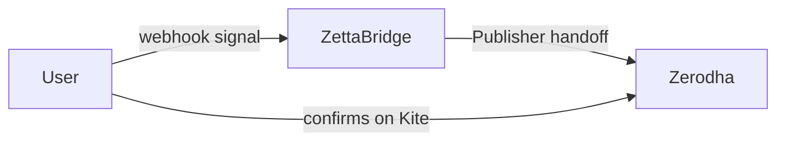
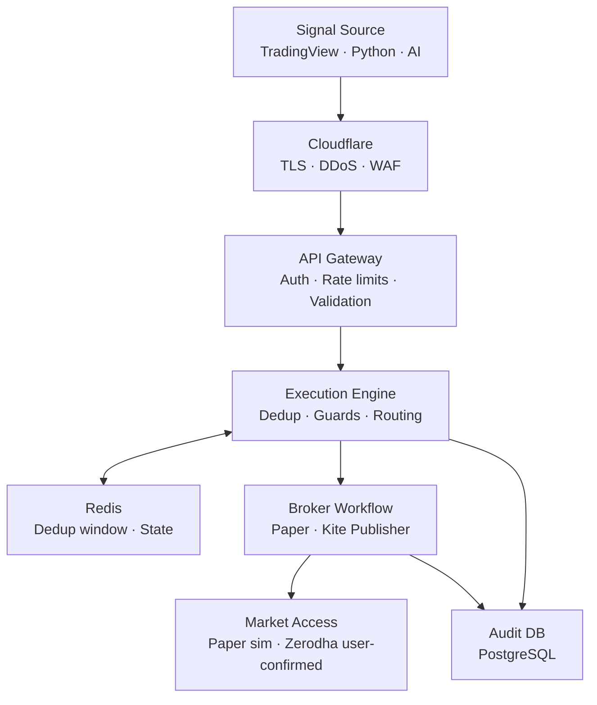
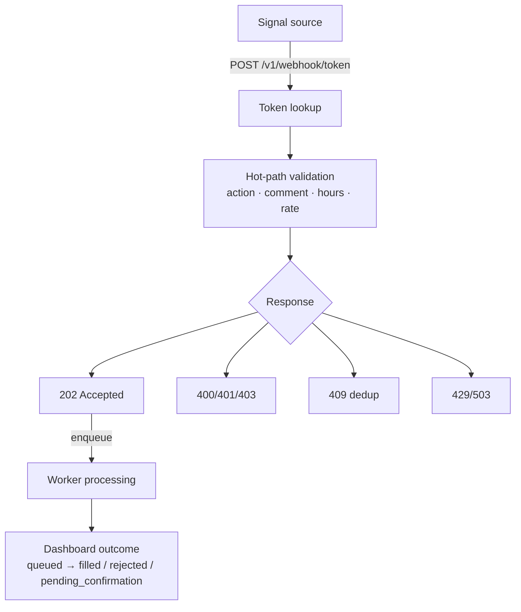
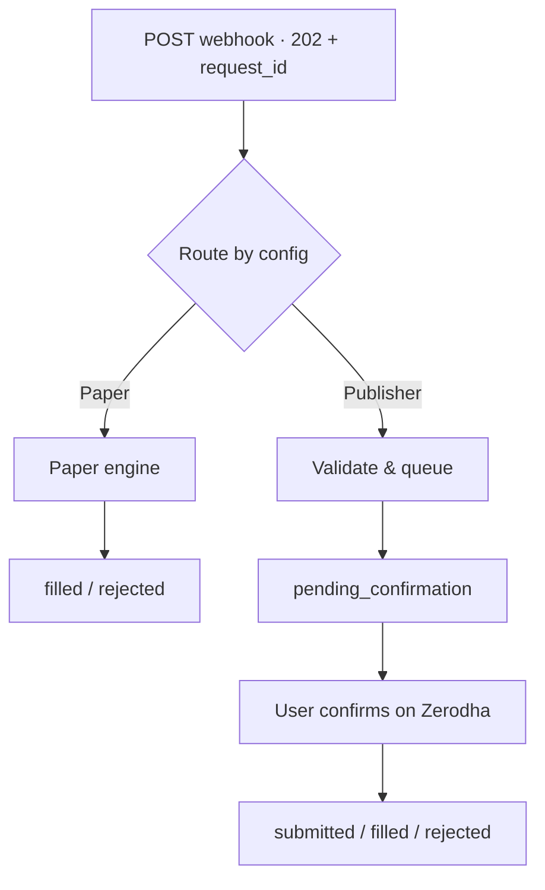
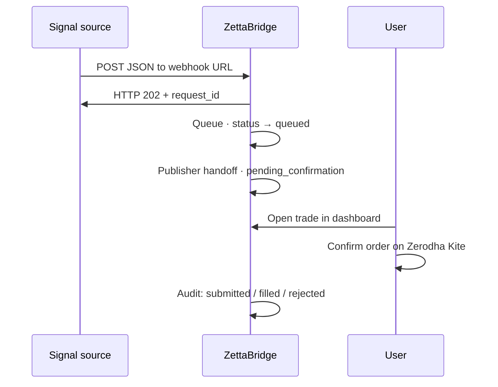
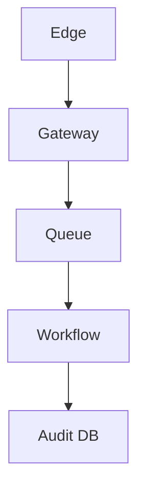
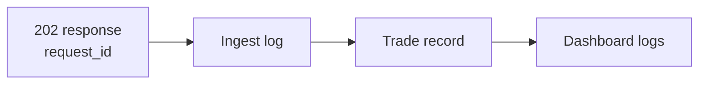
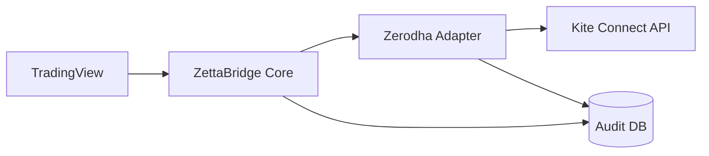
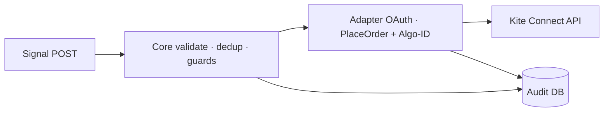

<!-- _class: title -->

# ZettaBridge × Zerodha

## Product capability, safety, security & transparency

**Demonstrating our platform for Kite Connect / Personal API consideration**

Closed Beta · Paper Trading Live · Kite Publisher in Closed Beta

---

## Purpose of this demo

We are here to:

1. Show **what ZettaBridge is** — an execution router, not a broker or adviser
2. Walk through the **end-to-end flow** with full transparency
3. Demonstrate **safety & security** at every stage
4. Explain **Paper trading** and **Kite Publisher** (what ships today)
5. Present our readiness for **Kite Connect** with SEBI Algo-ID compliance
6. Request Zerodha's **permission to proceed** with approved API integration

---

## What is ZettaBridge?

- Webhook-based **execution platform** for Indian retail algo traders
- Receives signals from **TradingView**, Python scripts, AI bots, HTTPS clients
- Routes each signal to a configured workflow:
  - **Paper engine** (built-in simulator)
  - **Zerodha Kite Publisher** (closed beta — user confirms on Kite)
- Returns **HTTP 202 Accepted** — validated & queued, not executed in the HTTP response
- Full **audit trail**: `request_id` → ingest log → trade record → dashboard

> We are an execution router — **not** a broker, investment adviser, or custodian.

---

## Compliance role boundary

| Role | Does | Does NOT |
|------|------|----------|
| **User / strategy author** | Creates signals, configures webhooks, confirms Zerodha orders | — |
| **ZettaBridge** | Validates & routes signals, logs audit trail, enforces guards | Investment advice, custody, discretionary trading |
| **Zerodha** | Order placement after user confirmation, accounts & funds | — |

---

# Architecture

## Enterprise-grade execution stack

---

## Webhook ingest sequence

*Synchronous validation at ingest · async processing after HTTP 202*

**Key:** No broker redirect in webhook response. Save `request_id` from 202.

---

# End-to-end flows

## Paper vs Kite Publisher

*Same ingest path — destination set per webhook configuration*

| | Paper | Kite Publisher |
|---|-------|----------------|
| Credentials | None | No stored Zerodha password |
| User action | None | **Must confirm on Kite** |
| Outcome | Simulated fill | Real order after confirmation |
| Use case | Strategy validation | Closed-beta live workflow |

---

## Paper trading workflow

1. User creates a **paper account** — no broker credentials
2. Webhook links to paper account with configured defaults
3. Signals simulate orders against paper balance & positions
4. Outcomes: **filled** or **rejected** — entirely inside ZettaBridge
5. Same ingest guards, dedup, rate limits, and audit logging as live

**Recommended:** Validate strategies on paper before enabling any Zerodha workflow.

---

## Kite Publisher — confirmation flow

*ZettaBridge never stores Zerodha login passwords*

---

## Trade status lifecycle

| Status | Meaning |
|--------|---------|
| `queued` | Accepted after HTTP 202 |
| `pending_confirmation` | Publisher — awaiting user on Zerodha |
| `submitted` | Order submission recorded |
| `filled` | Paper fill or broker confirmation |
| `rejected` | Error (may occur **after** 202) |
| `cancelled` | User or system |

**Publisher path:** `queued` → `pending_confirmation` → `submitted` → `filled`

Poll: `GET /v1/trades/{id}`

---

# Data & security

## What we store vs what we never store

| ✅ We store | ❌ We never store |
|------------|-------------------|
| Webhook config & defaults | Zerodha login password |
| Hashed webhook tokens | Customer funds or securities |
| Paper account records | TradingView credentials |
| Broker config labels | Bank / payment credentials |
| Order attempts & audit logs | |
| Optional tags (e.g. Algo-ID) | |

---

## Security controls at every stage

1. **Edge** — Cloudflare TLS, DDoS, WAF
2. **Ingest** — Hashed tokens, 60/min rate limit, 2s dedup, trading-hour guards
3. **Validation** — action, symbol, comment, plan gates — reject before queue where possible
4. **Processing** — Async workers; no synchronous broker call in webhook response
5. **Publisher** — User must confirm on Zerodha; no auto-placement
6. **Audit** — `request_id` → ingest log → trade record → dashboard
7. **Storage** — AES-256-GCM for secrets; PostgreSQL per-account isolation

---

## Audit trail — full traceability

Every signal is traceable from source through to final outcome — available for compliance review on request.

---

# Kite Publisher today

## Current capabilities (closed beta)

| Capability | Publisher behaviour |
|------------|---------------------|
| Signal ingest | HTTP 202 — async queue |
| Order placement | User confirms on Zerodha Kite |
| Actions | BUY / SELL only |
| OAuth session | Not required for Publisher handoff |
| Audit | Full `request_id` trail |
| Algo-ID | Not required (manual user-confirmed flow) |

---

## Kite Publisher — deliberate limitations

These are **features of the Publisher model**, not bugs:

- User must **manually confirm** every order — cannot fully automate from TradingView alone
- **Browser handoff** — not suitable for unattended server-side algo execution
- No programmatic order status stream equivalent to Kite Connect WebSocket
- **BUY/SELL only** at webhook configuration level
- User must be available to confirm (session-dependent)

We chose Publisher for closed beta to demonstrate **safety** without requesting Connect prematurely.

---

# Kite Connect / Personal API

## Publisher vs Kite Connect — honest comparison

| Dimension | Kite Publisher (today) | Kite Connect (requested) |
|-----------|------------------------|--------------------------|
| Automation | User confirms each order | Programmatic place/modify/cancel |
| Webhook → order | Queued; user acts later | Validated → API order with Algo-ID |
| Latency | Human confirmation step | Sub-second after guards |
| Order status | Poll + callback | Real-time via API / WebSocket |
| SEBI | Manual flow — no Algo-ID | Algo-ID registration & per-order tag |
| User safety | Maximum — every order reviewed | Guards + Algo-ID + audit |

---

## Why we are ready for Kite Connect

- **Architecture split**: Core (ingest, guards, audit) ↔ Zerodha adapter (Kite API, OAuth, NAT)
- **SEBI Algo-ID** tagging implemented — per order when configured
- **AES-256-GCM** encrypted credentials — tokens in PostgreSQL, never logged
- **OAuth on adapter host** — Core never receives Kite `request_token` on public internet
- **Guards**: dedup 2s, 60/min rate limit, plan gates, trading-hour checks — before API call
- **Staging on AWS ap-south-1** — private subnets, static NAT IP for Kite whitelist

---

## Proposed Kite Connect flow (post-approval)

*Same ingest safety layer — Connect replaces Publisher handoff*

Publisher remains available for users who prefer **manual confirmation**.

---

# Operational controls

## Rate limits, dedup & plan gates

| Control | Default | Purpose |
|---------|---------|---------|
| Per-webhook rate | 60 req/min | Prevent signal flooding |
| Dedup window | 2 seconds | Suppress duplicate alerts |
| Free plan cap | 100 ingests/day | Abuse prevention |
| Broker order rate | 10 orders/sec per config | Broker protection |
| Live plan gate | Pro / Pro Plus + beta approval | Controlled rollout |
| HTTP 409 | No retry | Original signal still processing |

---

# Our request to Zerodha

1. **Review** this demonstration of our closed-beta platform
2. **Acknowledge** our safety, security, and audit posture (Publisher integration)
3. **Grant permission** to proceed with Kite Connect / Personal API for approved users
4. **Whitelist** our staging/production NAT egress IP for Kite API
5. **Guide us** on SEBI Algo-ID registration for our platform category

**We commit to:**
- No public Connect promises until Zerodha-approved
- Conservative rollout with full audit transparency
- Compliance review access on request

---

## Next steps after approval

- Enable Kite Connect OAuth for closed-beta Pro / Pro Plus users
- Attach registered **Algo-ID** to every programmatic order
- Keep **Publisher** as an option for manual-confirmation users
- Publish integration docs and error-code reference
- Ongoing audit log access for compliance review

**Contact:** team@zettabridge.com  
**Staging:** api.staging.zettabridge.net

---

<!-- _class: title -->

# Thank you

## ZettaBridge — Safe, transparent execution routing

**We welcome your questions and feedback.**

Paper trading live today · Kite Publisher in closed beta · Kite Connect upon approval
